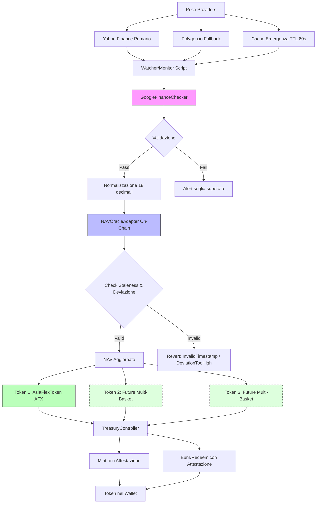

# ASIAFLEX — Piattaforma Multi-Basket per Token Indicizzati con Oracle NAV

Piattaforma decentralizzata per token ERC-20 ancorati a basket di asset reali, con oracle NAV (Net Asset Value), acquisizione prezzi multi-sorgente in tempo reale, validazione incrociata e controlli treasury per mint/redeem.

**Branch:** `copilot/update-readme-multi-basket` | **Data:** 2025-10-21 | **Commit:** `f6c7357`

---

## Panoramica Non Tecnica: Come Funziona

ASIAFLEX è progettato come piattaforma **multi-basket**: ogni token ERC-20 rappresenta un basket distinto di asset (es. Oro, BTC, ETH, coppie Forex). Il sistema attuale implementa un singolo token (AsiaFlexToken/AFX), ma l'architettura è progettata per supportare più token, ciascuno con il proprio basket e basketId.

### Flusso Operativo

1. **Provider Prezzi** → Acquisizione prezzi da fonti multiple (Yahoo Finance primario, Polygon.io fallback, cache emergenza)
2. **Watcher/Monitor** → Script di monitoraggio continuo che preleva prezzi per tutti gli asset nel basket
3. **Validazione Checker** → Confronto incrociato con Google Finance per rilevare anomalie e deviazioni significative
4. **Commit On-Chain** → Aggiornamento NAV tramite NAVOracleAdapter con protezione staleness e soglie di deviazione
5. **Mint/Redeem** → TreasuryController consente mint (fornendo riserve) e redeem (ritirando riserve) con attestazioni firmate

Il NAV (valore basket normalizzato) determina il valore del token. Quando il NAV si aggiorna, i possessori possono mintare nuovi token o riscattarli in base alle riserve del treasury.

### Diagramma di Flusso Multi-Basket



---

## Modello Token & Basket (Multi-Basket)

### Architettura Attuale (Single-Token)

L'implementazione corrente prevede **un singolo token ERC-20** (`AsiaFlexToken` con simbolo `AFX`) ancorato a un basket di asset definito in `scripts/ops/assets.map.ts`.

**Componenti del basket attuale:**

- **Asset Symbols**: `XAUUSD` (Oro), `BTCUSD` (Bitcoin), `ETHUSD` (Ethereum), `EURUSD` (EUR/USD), `USDJPY` (USD/JPY)
- **Ticker Yahoo Finance**: Mappatura in `YAHOO_TICKERS` e `YAHOO_TICKER_ALIASES`
- **Pesi**: (non ancora implementato - attualmente tutti gli asset hanno peso uguale)
- **Calcolo NAV**: Media ponderata dei prezzi asset, normalizzata in USD a 18 decimali

### Vision Multi-Basket (Roadmap)

La piattaforma è progettata per supportare **più token**, ciascuno identificato da un `basketId` univoco:

- **Token 1 (AFX)**: Basket Asia (Oro, BTC, ETH, Forex asiatici)
- **Token 2 (futuro)**: Basket Europa (asset europei)
- **Token 3 (futuro)**: Basket commodity (materie prime)

### Dove si Definiscono i Componenti del Basket

**File**: `scripts/ops/assets.map.ts`

```typescript
export const YAHOO_TICKERS: Record<string, string> = {
  XAUUSD: "GC=F", // Gold futures
  BTCUSD: "BTC-USD", // Bitcoin
  ETHUSD: "ETH-USD", // Ethereum
  EURUSD: "EURUSD=X", // EUR/USD forex
  USDJPY: "JPY=X", // USD/JPY forex
};

export const YAHOO_TICKER_ALIASES: Record<string, string> = {
  GOLD: "XAUUSD",
  BITCOIN: "BTCUSD",
  ETHER: "ETHUSD",
};
```

### Come Aggiungere un Nuovo Asset al Basket

1. **Identificare il ticker Yahoo Finance** per l'asset (es. `AAPL` per Apple, `GBPUSD=X` per GBP/USD)
2. **Modificare** `scripts/ops/assets.map.ts`:
   ```typescript
   export const YAHOO_TICKERS: Record<string, string> = {
     // ... asset esistenti
     AAPL: "AAPL", // Aggiungi nuovo asset
     GBPUSD: "GBPUSD=X", // Aggiungi nuova coppia forex
   };
   ```
3. **Configurare peso** (quando implementato) nel sistema di basket weighting
4. **Aggiornare GoogleFinanceChecker** se l'asset richiede override specifici (come `XAUUSD`)
5. **Testare** acquisizione prezzi: `npm run dev:watch-price`
6. **Deploy** e update NAV: `npx hardhat nav:update --nav <nuovo_valore> --network sepolia`

### Come Aggiungere un Nuovo Basket/Token (Roadmap)

**Nota**: Questa funzionalità richiede implementazione di factory/registry (vedi Roadmap).

Passi previsti (quando implementato):

1. **Creare nuovo contratto** `BasketToken` (derivato da `AsiaFlexToken`)
2. **Definire composizione** basket in configurazione dedicata
3. **Deploy** contratto con `basketId` univoco
4. **Registrare** nel registry globale
5. **Configurare** oracle NAV dedicato o condiviso
6. **Setup ruoli** TREASURY_ROLE, ORACLE_UPDATER_ROLE per il nuovo token

### Ricalcolo NAV

Il NAV viene ricalcolato quando:

- **Prezzi asset si aggiornano** (via watcher script automatico o manuale)
- **Composizione basket cambia** (rebalancing manuale)
- **Soglia staleness raggiunta** (forcing aggiornamento dati freschi)

**Trigger automatico** (non ancora implementato):

- Watcher loop continuo con `--interval` configurabile
- Alert webhook quando deviazione supera soglie

---

## Architettura & Tecnologie

### Moduli Core

| Modulo               | Responsabilità                                                  | File Chiave                  |
| -------------------- | --------------------------------------------------------------- | ---------------------------- |
| **Smart Contracts**  | Token ERC-20, Oracle NAV, Controller treasury con AccessControl | `contracts/*.sol`            |
| **Price Pipeline**   | Acquisizione multi-provider con fallback e validazione          | `scripts/ops/providers/*.ts` |
| **Asset Mapping**    | Mappatura simbolo → ticker per lookup prezzi                    | `scripts/ops/assets.map.ts`  |
| **NAV Watcher**      | Loop automatico feed prezzi con commit on-chain                 | `tasks/nav/update.ts`        |
| **Monitor & Status** | Health check, alerting, reporting                               | `scripts/ops/status.ts`      |
| **E2E Operations**   | Ciclo completo: mint → transfer → redeem → burn                 | `playground/demo-e2e.ts`     |

### Stack Tecnologico

- **Blockchain**: Ethereum (Solidity **0.8.26**), Sepolia testnet
- **Dev Framework**: Hardhat **3.x** con generazione TypeChain
- **Runtime**: Node.js **20.19.5** (o superiore), TypeScript **5.x**
- **Web3 Library**: Ethers.js **v6**
- **CI/CD**: GitHub Actions (lint → build → test → coverage → Slither → CodeQL)
- **Sorgenti Prezzi**:
  - **Yahoo Finance** (primario)
  - **Polygon.io API** (fallback)
  - **Google Finance** (checker validazione)
- **Standard**: ERC-20, EIP-2612 (permit), EIP-712 (typed signatures), AccessControl

### Ruoli & AccessControl

I contratti implementano un sistema granulare di ruoli basato su OpenZeppelin AccessControl:

| Ruolo                    | Scopo                                      | Assegnato A                         |
| ------------------------ | ------------------------------------------ | ----------------------------------- |
| `DEFAULT_ADMIN_ROLE`     | Grant/revoke tutti i ruoli                 | Deployer inizialmente               |
| `TREASURY_ROLE`          | Mint/burn token con attestazioni           | Treasury signer, TreasuryController |
| `PAUSER_ROLE`            | Pause/unpause operazioni token             | Team operations treasury            |
| `CAPS_MANAGER_ROLE`      | Modifica caps giornalieri mint/inflow      | Risk management                     |
| `BLACKLIST_MANAGER_ROLE` | Aggiunta/rimozione indirizzi blacklist     | Compliance                          |
| `ORACLE_UPDATER_ROLE`    | Submit nuovi valori NAV                    | Feeder wallet (automatizzato)       |
| `ORACLE_MANAGER_ROLE`    | Configurazione soglie staleness/deviazione | Oracle governance                   |
| `TREASURY_MANAGER_ROLE`  | Aggiornamento treasury signer              | Treasury governance                 |

### Politiche di Validazione

- **Clamp Timestamp**: Update NAV più vecchi di `stalenessThreshold` (default **86400s = 24h**) vengono rifiutati
- **Soglia Deviazione**: Variazioni NAV superiori a `deviationThreshold` (default **1000 basis points = 10%**) vengono rifiutate (a meno di flag `--force`)
- **Normalizzazione Prezzi**: Tutti i prezzi convertiti a **18 decimali** per consistenza on-chain
- **Modalità Degradata**: Se tutti i provider falliscono, vengono usati prezzi cached (max 60s old) con flag `degraded`

---

## Struttura del Codice

### Mappa Cartelle

| Percorso                 | Responsabilità                           | Entry Point                                                                                 |
| ------------------------ | ---------------------------------------- | ------------------------------------------------------------------------------------------- |
| `contracts/`             | Smart contract Solidity                  | `AsiaFlexToken.sol`, `NAVOracleAdapter.sol`, `TreasuryController.sol`, `ProofOfReserve.sol` |
| `contracts/interfaces/`  | Interfacce contratti                     | `IAsiaFlexToken.sol`, `INAVOracleAdapter.sol`, `ITreasuryController.sol`                    |
| `scripts/ops/`           | Script operativi per ciclo di vita token | `mint.ts`, `burn.ts`, `pause.ts`, `setCaps.ts`, `status.ts`, `assets.map.ts`                |
| `scripts/ops/providers/` | Implementazioni provider prezzi          | `Provider.ts`, `GoogleFinanceChecker.ts`                                                    |
| `scripts/deploy/`        | Script deployment                        | `00_deploy_asiaflex.ts`                                                                     |
| `scripts/`               | Script legacy JS                         | `mint.js`, `burn.js`, `transfer.js`, `processRedeemChat.js`                                 |
| `tasks/`                 | Task Hardhat per NAV e status            | `index.ts`, `nav/update.ts`, `roles.ts`, `status.ts`                                        |
| `playground/`            | Demo E2E e testing                       | `demo-e2e.ts`, `price-watcher.ts`, `README_DEMO.md`                                         |
| `test/unit/`             | Test unitari                             | `AsiaFlexToken.test.ts`, `NAVOracleAdapter.test.ts`, `TreasuryController.test.ts`           |
| `test/integration/`      | Test integrazione                        | `SystemIntegration.test.ts`                                                                 |
| `test/fixtures/`         | Fixture test                             | `AsiaFlexFixture.ts`                                                                        |
| `deployments/`           | Configurazioni deployment per network    | `sepolia.example.json`                                                                      |
| `.github/workflows/`     | Pipeline CI/CD                           | `ci.yml`, `slither.yml`, `codeql.yml`, `release.yml`, `branch-cleanup.yml`                  |

### Comandi CLI Reali

**Da `package.json`**:

```bash
# Build & Test
npm run build           # hardhat compile && tsc --project tsconfig.dist.json
npm test                # hardhat test
npm run coverage        # hardhat coverage
npm run typecheck       # tsc --noEmit
npm run lint            # lint:ts && lint:sol
npm run lint:fix        # Fix automatico linting

# Deployment
npm run deploy:sepolia  # hardhat run scripts/deploy/00_deploy_asiaflex.ts --network sepolia
npm run deploy:mainnet  # hardhat run scripts/deploy/00_deploy_asiaflex.ts --network mainnet
npm run deploy:polygon  # hardhat run scripts/deploy/00_deploy_asiaflex.ts --network polygon

# Operazioni
npm run ops:mint        # hardhat run scripts/ops/mint.ts
npm run ops:burn        # hardhat run scripts/ops/burn.ts
npm run ops:status      # hardhat run scripts/ops/status.ts

# Development
npm run dev:node        # hardhat node (local testnet)
npm run dev:demo        # hardhat run playground/demo-e2e.ts --network localhost
npm run dev:watch-price # ts-node playground/price-watcher.ts
```

**Task Hardhat** (da `tasks/`):

```bash
npx hardhat nav:update --nav 105.50 --network sepolia [--dry-run] [--force]
npx hardhat roles:list --network sepolia
npx hardhat roles:grant --contract AsiaFlexToken --role TREASURY_ROLE --account 0x... --network sepolia
npx hardhat roles:revoke --contract AsiaFlexToken --role TREASURY_ROLE --account 0x... --network sepolia
npx hardhat status --network sepolia
```

---

## Pipeline Prezzi & Checker

### Ordine di Priorità Provider

**Sequenza Fallback**: `Yahoo Finance → Polygon.io → Cache`

1. **Yahoo Finance** (primario)
   - Endpoint: API Yahoo Finance v8 chart/quote
   - Preleva `regularMarketPrice` o ultimo `close` da chart data
   - Supporta: azioni, ETF, crypto, forex, commodity futures

2. **Polygon.io** (fallback)
   - Attivato per simboli a 6 caratteri (es. `EURUSD`) e `XAUUSD` quando Yahoo fallisce
   - Richiede `POLYGON_API_KEY` in `.env`
   - Rate limit: dipende dal piano Polygon

3. **Cache** (emergenza)
   - Ritorna ultimo prezzo valido se < 60s old
   - Attivato solo con override `useLastKnown`
   - Flaggato come `degraded: true`

### Google Finance Checker

Il checker esegue validazione incrociata **dopo ogni fetch** provider:

**Funzionalità**:

- **Dashed Symbols**: `EURUSD` → `EUR-USD` (conversione automatica)
- **Inverse Pairs**: `USDEUR` → `1/EURUSD` (inversione calcolo)
- **Override**: `XAUUSD` → `GCW00:COMEX` (futures oro COMEX)

**Soglie Alert**:

- **FX Pairs**: 1.0% (default)
- **XAU (Oro)**: 1.5%

**Log Patterns**:

```
[CHECKER:DASHED] symbol=EURUSD resolved=EUR-USD
[CHECKER:INVERSE] symbol=USDEUR inverse=EURUSD
[CHECKER:OVERRIDE] symbol=XAUUSD override=GCW00:COMEX
[CHECKER:ALERT] symbol=XAUUSD diff=2.3% > threshold=1.5%
```

### Configurazione API Keys & ENV

**File**: `.env` (creato da `.env.example`)

| Variabile ENV           | Scopo                                 | Esempio                            | Richiesto |
| ----------------------- | ------------------------------------- | ---------------------------------- | --------- |
| `SEPOLIA_RPC_URL`       | Endpoint RPC Sepolia testnet          | `https://sepolia.infura.io/v3/KEY` | ✅        |
| `MAINNET_RPC_URL`       | Endpoint RPC Mainnet (per forking)    | `https://mainnet.infura.io/v3/KEY` | ❌        |
| `POLYGON_RPC_URL`       | Endpoint RPC Polygon network          | `https://polygon-rpc.com`          | ❌        |
| `PRIVATE_KEY`           | Chiave privata wallet deployer/feeder | `0x...`                            | ✅        |
| `FEEDER_PRIVATE_KEY`    | Chiave dedicata per NAV updates       | `0x...`                            | ❌        |
| `ETHERSCAN_API_KEY`     | API key per verifica contratti        | `YOUR_ETHERSCAN_KEY`               | ❌        |
| `POLYGONSCAN_API_KEY`   | API key Polygonscan                   | `YOUR_POLYGONSCAN_KEY`             | ❌        |
| `POLYGON_API_KEY`       | API key Polygon.io per prezzi         | `YOUR_POLYGON_KEY`                 | ❌        |
| `OPS_ALERT_WEBHOOK`     | Webhook URL per alert operazioni      | `https://hooks.slack.com/...`      | ❌        |
| `REPORT_GAS`            | Abilita gas reporting nei test        | `true` / `false`                   | ❌        |
| `COINMARKETCAP_API_KEY` | API CoinMarketCap per prezzi gas USD  | `YOUR_CMC_KEY`                     | ❌        |
| `TREASURY_SIGNER`       | Indirizzo treasury signer             | `0x...`                            | ❌        |
| `ORACLE_MAX_AGE`        | Staleness threshold (secondi)         | `3600` (1h)                        | ❌        |
| `ORACLE_MAX_DEVIATION`  | Deviation threshold (basis points)    | `100` (1%)                         | ❌        |

**Setup `.env`**:

```bash
cp .env.example .env
# Modifica .env con le tue credenziali (NON committare mai .env)
```

---

## Setup & Configurazione

### Requisiti

- **Node.js**: 20.19.5 o superiore (LTS raccomandato, Hardhat 3.x richiede Node 22 idealmente)
- **Package Manager**: npm 10.x (o pnpm)
- **Hardhat**: 3.x (installato automaticamente via npm)
- **API Keys** (opzionali ma raccomandati):
  - Sepolia RPC URL (Infura, Alchemy, o public)
  - Polygon.io API key (per fallback provider)
  - Etherscan API key (per verifica contratti)
- **Wallet**: Private key per account feeder con `ORACLE_UPDATER_ROLE`

### Installazione Dipendenze

```bash
cd /path/to/ASIAFLEX

# Installa dipendenze (usa --legacy-peer-deps per compatibilità)
npm ci --legacy-peer-deps

# Compila contratti Solidity
npx hardhat compile

# Build TypeScript
npm run build

# Verifica type checking
npm run typecheck

# Esegui linter
npm run lint
```

### Configurazione Variabili ENV

Crea file `.env` partendo da `.env.example`:

```bash
cp .env.example .env
```

**Modifica `.env` con i tuoi valori** (vedi tabella completa in sezione "Pipeline Prezzi & Checker").

**Variabili minime richieste**:

```bash
SEPOLIA_RPC_URL=https://sepolia.infura.io/v3/YOUR_INFURA_KEY
PRIVATE_KEY=0xYOUR_DEPLOYER_PRIVATE_KEY
```

**⚠️ Sicurezza**:

- **MAI committare `.env`** con chiavi reali (già in `.gitignore`)
- Usa wallet separati per deploy e feeder
- Ruota chiavi regolarmente
- Usa hardware wallet in produzione

---

## Quick Start (Locale & Test)

### Test Suite

```bash
# Esegui tutti i test (unit + integration)
npm test

# Esegui test con gas reporting
REPORT_GAS=true npm test

# Esegui coverage con Solidity Coverage
npm run coverage

# Test specifici
npx hardhat test test/unit/AsiaFlexToken.test.ts
npx hardhat test test/integration/SystemIntegration.test.ts
```

### Network Locale (Hardhat Node)

```bash
# Avvia nodo Hardhat locale in una finestra
npm run dev:node

# In altra finestra: deploy contratti su localhost
npx hardhat run scripts/deploy/00_deploy_asiaflex.ts --network localhost

# Esegui demo E2E completo
npm run dev:demo
```

Il demo E2E (`playground/demo-e2e.ts`) esegue:

1. Deploy AsiaFlexToken, NAVOracleAdapter, TreasuryController
2. Setup ruoli (TREASURY_ROLE, ORACLE_UPDATER_ROLE, etc.)
3. Mint iniziale di token
4. Transfer tra account
5. Update NAV oracle
6. Redeem e burn token
7. Genera report JSON in `reports/`

---

## Aggiornamento Prezzi & NAV

### Update NAV via Task Hardhat

Aggiorna il valore NAV on-chain usando il task Hardhat:

```bash
# Update NAV a $105.50 su Sepolia (dry run - simulazione)
npx hardhat nav:update --nav 105.50 --network sepolia --dry-run

# Update NAV con commit on-chain effettivo
npx hardhat nav:update --nav 105.50 --network sepolia

# Force update (bypassa check deviazione - solo emergenza)
npx hardhat nav:update --nav 105.50 --network sepolia --force

# Specifica indirizzo oracle custom (se diverso da deployment)
npx hardhat nav:update --nav 105.50 --oracle 0x... --network sepolia
```

**Output Atteso**:

```
🔮 Updating NAV Oracle on sepolia
👤 Signer: 0x1234567890abcdef...
💰 New NAV: $105.50
🚨 Force Mode: OFF
🧪 Dry Run: OFF

🔍 Pre-flight checks:
   Oracle Updater Role: ✅
   Oracle Manager Role: ✅
   Oracle Paused: ✅

📊 Current Oracle State:
   Current NAV: $100.00
   Last Update: 10/21/2025, 12:00:00 PM
   Staleness Threshold: 86400 seconds (24.00 hours)
   Deviation Threshold: 10.0%
   Status: 🟢 FRESH

⚖️  Deviation Analysis:
   New NAV: $105.50
   Deviation: 5.5%
   Within Threshold: ✅

✅ NAV updated successfully
Transaction Hash: 0xabcdef1234567890...
Gas Used: 54321
```

### Price Watcher Demo (Development)

Monitora prezzi live in modalità sviluppo:

```bash
# Esegui price watcher demo (richiede assets.map.ts configurato)
npm run dev:watch-price
```

Questo script (`playground/price-watcher.ts`):

- Preleva prezzi da Yahoo Finance per tutti gli asset in `YAHOO_TICKERS`
- Valida con Google Finance Checker
- Mostra output console con prezzi normalizzati a 18 decimali
- **Non esegue commit on-chain** (solo monitoring)

**Nota**: Per watcher automatico in produzione con loop e commit on-chain, vedere sezione Roadmap. Attualmente disponibile:

- ✅ Logica fallback provider in `scripts/ops/providers/Provider.ts`
- ✅ Google Finance checker in `scripts/ops/providers/GoogleFinanceChecker.ts`
- ✅ Update NAV manuale via `tasks/nav/update.ts`
- ❌ Loop automatico con `--interval` (non ancora implementato)
- ❌ Auto-commit NAV dopo fetch prezzi (non ancora implementato)

---

## Monitor & Status

### Verifica Stato Sistema

Monitora health dei contratti deployati:

```bash
# Verifica stato tutti i contratti su Sepolia
npm run ops:status -- --network sepolia

# Output: NAV corrente, staleness, caps, ruoli, pause status, etc.
```

**Script**: `scripts/ops/status.ts`

Output tipico:

```
📊 System Status on sepolia
🔮 NAV Oracle: $100.00 (updated 2h ago, FRESH)
🪙 AsiaFlexToken: 1,000,000 AFX supply cap
   Daily Mint Cap: 10,000 AFX (9,500 remaining)
   Daily Net Inflow: 5,000 AFX (4,800 remaining)
   Paused: NO
🏦 Treasury Controller: 0x...
   Treasury Signer: 0x...
   Request Expiration: 3600s
```

### Gestione Ruoli

Verifica e gestisci ruoli per i contratti:

```bash
# Lista tutti i ruoli per i contratti
npx hardhat roles:list --network sepolia

# Grant di un ruolo (richiede DEFAULT_ADMIN_ROLE)
npx hardhat roles:grant \
  --contract AsiaFlexToken \
  --role TREASURY_ROLE \
  --account 0x1234567890abcdef... \
  --network sepolia

# Revoke di un ruolo
npx hardhat roles:revoke \
  --contract AsiaFlexToken \
  --role TREASURY_ROLE \
  --account 0x1234567890abcdef... \
  --network sepolia
```

**Task**: `tasks/roles.ts`

### Monitoring & Alerting Automatico (Futuro)

**Feature in Roadmap** (non ancora implementate):

- [ ] **Watcher automatico** con loop mode e intervalli configurabili (`--interval 600`)
- [ ] **Integrazione webhook** per alert su eventi critici (staleness, deviazioni, errori provider)
- [ ] **Sistema report & archival** con validazione JSON e retention policy
- [ ] **Alert deviazione** Google Finance quando supera soglie configurate
- [ ] **Notifiche Slack/Discord** via `OPS_ALERT_WEBHOOK`

Quando implementate, queste feature forniranno:

- Monitoraggio prezzi continuo con gestione fallback automatica
- Alert su deviazioni Google Finance oltre soglia
- Retention storica report con timestamp e validazione
- Webhook notifications per staleness NAV e failure provider

---

## Guida Operativa: Far Partire Tutto e Ottenere Token nel Wallet

### Prerequisiti

1. **Ruoli Configurati**: Assicurati che il tuo wallet abbia `TREASURY_ROLE` per operazioni mint/burn
2. **NAV Aggiornato**: Valore NAV recente on-chain (verifica con `npm run ops:status -- --network sepolia`)
3. **Network Setup**: Connesso a Sepolia testnet con ETH sufficiente per gas
4. **Deployment Config**: File deployment valido in `deployments/sepolia.json`

### Demo E2E Completo (Sviluppo Locale)

Esegui demo E2E completo su rete Hardhat locale:

```bash
# 1. Avvia nodo Hardhat locale in una finestra
npm run dev:node

# 2. In altra finestra, esegui demo E2E
npm run dev:demo
```

**Cosa fa il demo** (`playground/demo-e2e.ts`):

1. ✅ Deploy contratti: AsiaFlexToken, NAVOracleAdapter, TreasuryController
2. ✅ Setup ruoli: TREASURY_ROLE, ORACLE_UPDATER_ROLE, PAUSER_ROLE
3. ✅ Mint iniziale 1000 AFX a account1
4. ✅ Transfer 500 AFX da account1 a account2
5. ✅ Update NAV oracle a $110
6. ✅ Burn 200 AFX da account1
7. ✅ Genera report JSON con dettagli transazioni in `reports/`

### Operazioni Individuali

#### 1. Mint Token

**Script TS** (raccomandato):

```bash
# Modifica scripts/ops/mint.ts per configurare:
# - recipient: indirizzo destinatario
# - amount: quantità in AFX (es. 100)
# - attestationHash: (opzionale, default ethers.ZeroHash)

npx hardhat run scripts/ops/mint.ts --network sepolia
```

**Script JS** (legacy):

```bash
# Modifica scripts/mint.js con parametri
npx hardhat run scripts/mint.js --network sepolia
```

**Output Atteso**:

```
🪙 Executing mint operation on sepolia
👤 Signer: 0x1234567890abcdef...
🎯 To: 0xRecipient...
💰 Amount: 100 AFX
🔍 Pre-flight checks:
   Treasury Role: ✅
   Contract Paused: ✅ (not paused)
   Remaining Daily Mint: 9900 AFX
✅ Mint successful
Transaction Hash: 0xabcdef1234...
Gas Used: 87654
```

#### 2. Transfer Token

**Script**:

```bash
# Modifica scripts/transfer.js con:
# - recipient: indirizzo destinatario
# - amount: quantità in AFX

npx hardhat run scripts/transfer.js --network sepolia
```

**Manuale** (via console Hardhat):

```javascript
npx hardhat console --network sepolia

const token = await ethers.getContractAt("AsiaFlexToken", "TOKEN_ADDRESS");
const tx = await token.transfer("0xRecipient", ethers.parseEther("50"));
await tx.wait();
console.log("Transfer completato:", tx.hash);
```

#### 3. Redeem Token

**Script**:

```bash
# Redeem = burn + withdraw reserves
# Richiede: attestazione firmata da treasury signer
# Modifica scripts/processRedeemChat.js con parametri

npx hardhat run scripts/processRedeemChat.js --network sepolia
```

**Parametri**:

- `--from`: Holder address
- `--amount`: Quantità da redeem in AFX
- `--attestation-hash`: Proof hash withdrawal riserve (richiesto)

**Nota**: Feature autosign EIP-712 per redemption in roadmap (non ancora implementata).

#### 4. Burn Token

**Script TS**:

```bash
# Modifica scripts/ops/burn.ts con:
# - holder: indirizzo da cui burnare
# - amount: quantità in AFX

npx hardhat run scripts/ops/burn.ts --network sepolia
```

**Script JS** (legacy):

```bash
npx hardhat run scripts/burn.js --network sepolia
```

### Verifica Token in Wallet (Metamask)

#### Aggiungi Network Sepolia

1. Apri Metamask → **Aggiungi Network**
2. **Network Name**: Sepolia Testnet
3. **RPC URL**: `https://sepolia.infura.io/v3/YOUR_KEY` (usa il tuo `SEPOLIA_RPC_URL`)
4. **Chain ID**: `11155111`
5. **Currency Symbol**: `ETH`
6. **Block Explorer**: `https://sepolia.etherscan.io`

#### Aggiungi Token AsiaFlex

1. **Recupera indirizzo token** da `deployments/sepolia.json`:
   ```bash
   cat deployments/sepolia.json | grep AsiaFlexToken
   ```
2. Metamask → **Import Token** → **Custom Token**
3. **Token Contract Address**: (indirizzo da step 1)
4. **Token Symbol**: `AFX`
5. **Token Decimal**: `18`

#### Verifica Balance

Il tuo balance AFX apparirà automaticamente in Metamask dopo import token.

### Sequenza Test Minima End-to-End

```bash
# 1. Verifica stato sistema
npm run ops:status -- --network sepolia

# 2. Mint 1 AFX a tuo wallet
# Modifica scripts/ops/mint.ts:
#   recipient = "TUO_INDIRIZZO_WALLET"
#   amount = ethers.parseEther("1")
npx hardhat run scripts/ops/mint.ts --network sepolia

# 3. Verifica balance su Sepolia Etherscan
# https://sepolia.etherscan.io/token/TOKEN_ADDRESS?a=TUO_WALLET

# 4. Verifica balance in Metamask
# Apri Metamask → dovresti vedere 1 AFX

# 5. Transfer 0.5 AFX a altro indirizzo
# Modifica scripts/transfer.js:
#   recipient = "ALTRO_INDIRIZZO"
#   amount = ethers.parseEther("0.5")
npx hardhat run scripts/transfer.js --network sepolia

# 6. Verifica nuovo balance (0.5 AFX rimanenti)
# Metamask + Etherscan

# 7. Burn 0.3 AFX
# Modifica scripts/ops/burn.ts:
#   holder = "TUO_INDIRIZZO_WALLET"
#   amount = ethers.parseEther("0.3")
npx hardhat run scripts/ops/burn.ts --network sepolia

# 8. Verifica final balance (0.2 AFX rimanenti)
```

**Output Atteso**: Variazioni balance visibili in Metamask e su Etherscan entro 1-2 blocchi (~12-24 secondi su Sepolia).

---

## Troubleshooting

### Errori Comuni

#### `execution reverted: InvalidTimestamp`

**Causa**: Timestamp update NAV troppo vecchio (supera `stalenessThreshold` = 24h default)

**Fix**:

```bash
# Update NAV con timestamp fresco (usa --force solo in emergenza)
npx hardhat nav:update --nav <NUOVO_VALORE> --network sepolia

# Se ancora errore, force bypass checks deviazione
npx hardhat nav:update --nav <NUOVO_VALORE> --network sepolia --force
```

#### `AccessControl: account 0x... is missing role 0x...`

**Causa**: Wallet signer non ha ruolo richiesto (es. `ORACLE_UPDATER_ROLE`, `TREASURY_ROLE`)

**Fix**:

```bash
# 1. Verifica ruoli correnti
npm run ops:status -- --network sepolia

# 2. Lista ruoli per contratto specifico
npx hardhat roles:list --network sepolia

# 3. Grant ruolo (richiede DEFAULT_ADMIN_ROLE)
npx hardhat roles:grant \
  --contract NAVOracleAdapter \
  --role ORACLE_UPDATER_ROLE \
  --account 0xFEEDER_ADDRESS \
  --network sepolia
```

#### `Provider rate limit exceeded`

**Causa**: Troppe richieste a Yahoo Finance o Polygon.io

**Fix**:

- Implementa exponential backoff (roadmap item)
- Usa cache con TTL più lungo
- Riduci frequenza fetch (se in loop mode)
- Attendi 60 secondi tra richieste manuali

#### `Google Finance checker diff too high`

**Causa**: Prezzo da provider differisce >1.0% (FX) o >1.5% (XAU) da Google Finance

**Fix**:

1. **Verifica ticker corretto** in `assets.map.ts`
2. **Controlla logs** per resolution path:
   ```
   [CHECKER:DASHED] symbol=EURUSD resolved=EUR-USD
   [CHECKER:ALERT] symbol=XAUUSD diff=2.3% > threshold=1.5%
   ```
3. **Valuta condizioni mercato**: Alta volatilità o gap bid/ask
4. **Aggiorna soglie** se necessario (modifica `GoogleFinanceChecker.ts`)

#### `DailyCapsExceeded`

**Causa**: Quantità mint/burn supera caps giornalieri configurati

**Fix**:

```bash
# 1. Verifica capacità rimanente
npm run ops:status -- --network sepolia
# Output: "Daily Mint Cap: 10,000 AFX (2,500 remaining)"

# 2. Aumenta caps (richiede CAPS_MANAGER_ROLE)
# Modifica scripts/ops/setCaps.ts con nuovi valori:
#   maxDailyMint: ethers.parseEther("20000")
#   maxDailyNetInflows: ethers.parseEther("10000")
npx hardhat run scripts/ops/setCaps.ts --network sepolia

# 3. Verifica nuovo limite
npm run ops:status -- --network sepolia
```

#### `Contract is paused`

**Causa**: Contratto token o oracle in stato paused

**Fix**:

```bash
# Unpause token (richiede PAUSER_ROLE)
# Modifica scripts/ops/pause.ts per set unpause=true
npx hardhat run scripts/ops/pause.ts --network sepolia

# Unpause oracle (richiede ORACLE_MANAGER_ROLE)
# Usa console Hardhat:
npx hardhat console --network sepolia
> const oracle = await ethers.getContractAt("NAVOracleAdapter", "ORACLE_ADDRESS")
> await oracle.unpause()
```

#### `insufficient funds for gas`

**Causa**: Wallet non ha abbastanza ETH per gas

**Fix**:

```bash
# Ottieni Sepolia ETH da faucet:
# https://sepoliafaucet.com/
# https://www.alchemy.com/faucets/ethereum-sepolia

# Verifica balance:
npx hardhat console --network sepolia
> (await ethers.provider.getBalance("TUO_WALLET")).toString()
```

#### TypeScript Errors su Import Hardhat

**Causa**: Hardhat 3.x richiede ESM, ma progetto è configurato CommonJS

**Fix**:

Questo è un problema noto. Il progetto compila correttamente con `npm run build` ma TypeCheck fallisce. Per ora:

```bash
# Usa solo hardhat compile (ignora typecheck per ora)
npx hardhat compile

# Oppure skippa type checking
npm run build 2>&1 | grep -v "error TS"
```

**Roadmap**: Migrazione a ESM completo (`"type": "module"` in `package.json`).

---

## Roadmap / Cosa Manca

### Priorità Alta

#### 1. Factory/Registry Multi-Token

**Status**: Non implementato

**Descrizione**: Sistema per deployare e gestire più token basket da una factory centrale.

**File da creare**:

- `contracts/BasketTokenFactory.sol`: Factory per deploy nuovi token
- `contracts/BasketRegistry.sol`: Registry globale per tracking token/basket
- `scripts/deploy/deploy-factory.ts`: Script deploy factory

**Impatto**:

- Permette creazione di Token 2, Token 3, etc. (vision multi-basket)
- Ogni token con basketId univoco e composizione indipendente
- Registry per query "quali token esistono?" e "qual è il basket per tokenX?"

#### 2. Autosign Redeem (EIP-712)

**Status**: Parzialmente implementato (EIP-712 domain in TreasuryController, ma no autosign)

**Feature Mancanti**:

- Script `scripts/ops/sign-permit.ts` per generare firme EIP-712
- CLI flags: `--permit-json`, `--e2e-autosign`
- Variabili ENV: `TREASURY_SIGNER_KEY`, `EIP712_DOMAIN`, `PERMIT_JSON_PATH`
- Retry logic per redemption fallite

**File da creare/modificare**:

- `scripts/ops/sign-permit.ts`: Genera firma EIP-712 per redemption
- `scripts/processRedeemChat.js`: Integrare autosign
- `test/integration/redeem-e2e.test.ts`: Test E2E autosign

#### 3. Watcher Automatico con Loop Mode

**Status**: Fondamenta presenti, loop mode non implementato

**Feature Mancanti**:

- Flag `--interval <seconds>` per loop continuo
- Flag `--commit` per auto-commit NAV dopo fetch prezzi
- Exponential backoff su provider failures
- Circuit breaker dopo N failure consecutivi

**File da creare/modificare**:

- `scripts/ops/watcher.ts`: Loop continuo con auto-commit
- `scripts/ops/providers/Provider.ts`: Aggiungere retry logic ed exponential backoff

**Comandi Target**:

```bash
# Watcher continuo ogni 10 minuti con auto-commit
npm run ops:watch -- --interval 600 --commit --network sepolia

# Watcher once (modalità corrente)
npm run ops:watch -- --once --network sepolia
```

#### 4. Basket Weighting System

**Status**: Non implementato

**Descrizione**: Sistema per definire pesi asset nel basket (attualmente tutti asset peso uguale).

**File da creare/modificare**:

- `scripts/ops/assets.map.ts`: Aggiungere campo `weights`
- `scripts/ops/calc-nav.ts`: Calcolo NAV ponderato
- `contracts/NAVCalculator.sol`: (opzionale) Calcolo NAV on-chain

**Esempio Configurazione**:

```typescript
export const BASKET_WEIGHTS: Record<string, number> = {
  XAUUSD: 0.3, // 30% Oro
  BTCUSD: 0.25, // 25% Bitcoin
  ETHUSD: 0.2, // 20% Ethereum
  EURUSD: 0.15, // 15% EUR/USD
  USDJPY: 0.1, // 10% USD/JPY
};
```

### Priorità Media

#### 5. Report & Observability Hardening

**Feature Mancanti**:

- Structured logging con severity levels (info/warn/error)
- Enhanced webhook payloads con breakdown provider, gas usage
- Retention policy automation (purge report >90 giorni)
- Grafana/Prometheus metrics export

**File da creare**:

- `utils/logger.ts`: Structured logger
- `scripts/ops/report-archiver.ts`: Retention policy automation

#### 6. Multi-Network Support

**Status**: Supporto base presente (Sepolia, Mainnet, Polygon in hardhat.config.ts), ma non testato

**Feature Mancanti**:

- Deployment scripts con config produzione per Mainnet/Polygon
- Cross-chain NAV synchronization (LayerZero, Chainlink CCIP)
- Network-specific gas optimization

#### 7. Governance Integration

**Feature Mancanti**:

- Timelock per modifiche parametri critici
- Multisig per grant ruoli
- On-chain proposal system per rebalancing basket

**File da creare**:

- `contracts/Governance.sol`: Timelock + proposal system
- `contracts/Multisig.sol`: O integrazione Gnosis Safe

### Priorità Bassa / Nice-to-Have

#### 8. Web UI Dashboard

**Feature Desiderate**:

- Real-time NAV display
- Interfaccia mint/redeem per utenti
- Grafici storici prezzi
- Portfolio tracking

#### 9. Oracle Features Avanzati

**Feature Desiderate**:

- TWAP (Time-Weighted Average Price)
- Mediana su più oracle sources
- Integrazione Chainlink come fallback

### Migrazioni Tecniche

#### 10. Migrazione ESM

**Status**: Progetto usa CommonJS, Hardhat 3.x raccomanda ESM

**Impatto**: Fix TypeScript errors su import Hardhat

**File da modificare**:

- `package.json`: Aggiungere `"type": "module"`
- Tutti import: `require()` → `import`
- `tsconfig.json`: Aggiornare `module` e `moduleResolution`

### Known TODOs/FIXMEs nel Codice

**Nessun TODO/FIXME esplicito trovato nel codebase** (al 2025-10-21).

Se emergeranno durante sviluppo:

- **File**: `path/to/file.ts:line`
- **Issue**: Breve descrizione
- **Priority**: High/Medium/Low

---

## CI/CD

### Pipeline GitHub Actions

Tutti i PR e push su `main`/`develop` attivano check automatici:

| Job          | Scopo                                    | Workflow File | Trigger              |
| ------------ | ---------------------------------------- | ------------- | -------------------- |
| **Lint**     | TypeScript & Solidity linting            | `ci.yml`      | Push/PR main/develop |
| **Build**    | Compile contratti & TypeScript           | `ci.yml`      | Push/PR main/develop |
| **Test**     | Esegui test unit & integration           | `ci.yml`      | Push/PR main/develop |
| **Coverage** | Misura test coverage, upload Codecov     | `ci.yml`      | Push/PR main/develop |
| **Slither**  | Analisi statica vulnerabilità Solidity   | `slither.yml` | PR su main/develop   |
| **CodeQL**   | Security scanning CodeQL                 | `codeql.yml`  | Push main/develop    |
| **Release**  | Semantic versioning e release automatico | `release.yml` | Push su main         |

### Workflow Files Reali

**Location**: `.github/workflows/`

| File                          | Descrizione                              | Attivazione                             |
| ----------------------------- | ---------------------------------------- | --------------------------------------- |
| `ci.yml`                      | Pipeline CI principale (lint/build/test) | Push/PR su main/develop                 |
| `slither.yml`                 | Static analysis Slither                  | PR su main/develop                      |
| `codeql.yml`                  | CodeQL security scanning                 | Push main/develop, schedule settimanale |
| `release.yml`                 | Semantic release automation              | Push su main (dopo merge)               |
| `branch-cleanup.yml`          | Cleanup branch merged automatico         | Cron giornaliero                        |
| `branch-audit.yml`            | Audit branch stale                       | Cron settimanale                        |
| `auto-delete-merged-head.yml` | Delete head branch dopo merge PR         | PR close                                |

### Quality Gates

**Per Merge su main**:

- ✅ Tutti i linter passano (0 warnings TS, informational Solidity)
- ✅ Test coverage non diminuisce
- ✅ Nessun finding Slither alta severità
- ✅ Build successful su Node.js 20
- ✅ CodeQL no critical issues

### Comandi Manuali

**Trigger workflow da CLI**:

```bash
# Re-run workflow fallito (richiede gh CLI)
gh workflow run ci.yml --ref your-branch

# Visualizza runs recenti
gh run list --workflow=ci.yml

# Logs di un run specifico
gh run view <RUN_ID> --log
```

**Esegui Slither localmente** (prima di push):

```bash
# Installa Slither
pip3 install slither-analyzer

# Run Slither su contracts/
slither . --config-file slither.config.json

# Run con filtri specifici
slither . --exclude-informational --exclude-low
```

**Badge Status**:

```markdown
[](https://github.com/PolPol45/ASIAFLEX/actions)
[](https://codecov.io/gh/PolPol45/ASIAFLEX)
```

---

## Nota sul Naming: Ridenominare AsiaFlexToken

### Problema

Il nome attuale `AsiaFlexToken` (simbolo `AFX`) è specifico per il primo basket, ma la piattaforma è progettata per supportare **più basket/token**. Un nome più generico faciliterebbe l'espansione.

### Proposta

**Opzione 1**: `BasketToken` (generico, estendibile)
**Opzione 2**: `IndexToken` (simile a ETF/index fund)
**Opzione 3**: Mantenere `AsiaFlexToken` come primo token, usare `BasketTokenV2` per successivi

### Impatto su EIP-2612 Domain Separator

Il cambio nome **modifica il domain separator EIP-712** usato per `permit()`:

```solidity
// Attuale
constructor(...) ERC20Permit("AsiaFlexToken") { ... }

// Proposto
constructor(...) ERC20Permit("BasketToken") { ... }
```

**⚠️ Conseguenze**:

- Permit signatures firmate con vecchio domain separator diventano invalide
- Richiede re-deploy contratto (o proxy upgrade pattern)
- Frontend/dApp devono aggiornare EIP-712 domain

### File da Modificare (se si procede)

1. **Contratto**:
   - `contracts/AsiaFlexToken.sol` → `contracts/BasketToken.sol`
   - Constructor: `ERC20("AsiaFlex Token", "AFX")` → `ERC20("Basket Token", "BSK")`
   - `ERC20Permit("AsiaFlexToken")` → `ERC20Permit("BasketToken")`

2. **Deploy Script**:
   - `scripts/deploy/00_deploy_asiaflex.ts` → Aggiornare nome contratto

3. **Test**:
   - `test/unit/AsiaFlexToken.test.ts` → Aggiornare import e riferimenti
   - `test/integration/SystemIntegration.test.ts` → Aggiornare

4. **Ops Scripts**:
   - `scripts/ops/mint.ts`, `burn.ts`, `status.ts` → Aggiornare riferimenti contratto

5. **Deployment Config**:
   - `deployments/*.json` → Aggiornare `addresses.BasketToken`

### Raccomandazione

**Per ora**: Mantenere `AsiaFlexToken` come nome legacy per il primo token.

**Futuro**: Quando si implementa factory/registry multi-token, deployare nuovi token con naming generico (`BasketToken_<ID>` o `IndexToken_<ID>`).

---

## Contributing

1. Fork repository
2. Crea feature branch (`git checkout -b feature/tua-feature`)
3. Modifiche minime e focalizzate
4. Esegui linter e test (`npm run lint && npm test`)
5. Commit con conventional commits (es. `feat:`, `fix:`, `docs:`)
6. Push e apri PR contro branch `main`

**Checklist PR**:

- [ ] Test passano localmente
- [ ] Codice linted e formattato
- [ ] Documentazione aggiornata (se applicabile)
- [ ] Nessun nuovo issue alta severità (esegui Slither locale)
- [ ] Nessun secret committato

---

## Licenza

MIT License - vedi file [LICENSE](./LICENSE) per dettagli.

---

## Contatti & Supporto

- **Issues**: [GitHub Issues](https://github.com/PolPol45/ASIAFLEX/issues)
- **Discussions**: [GitHub Discussions](https://github.com/PolPol45/ASIAFLEX/discussions)
- **Security**: Segnala vulnerabilità privatamente via GitHub Security Advisories
- **Repository**: [github.com/PolPol45/ASIAFLEX](https://github.com/PolPol45/ASIAFLEX)

---

**Ultimo Aggiornamento**: 2025-10-21 | **Branch**: `copilot/update-readme-multi-basket` | **Versione**: 1.0.1 | **Commit**: `f6c7357`
