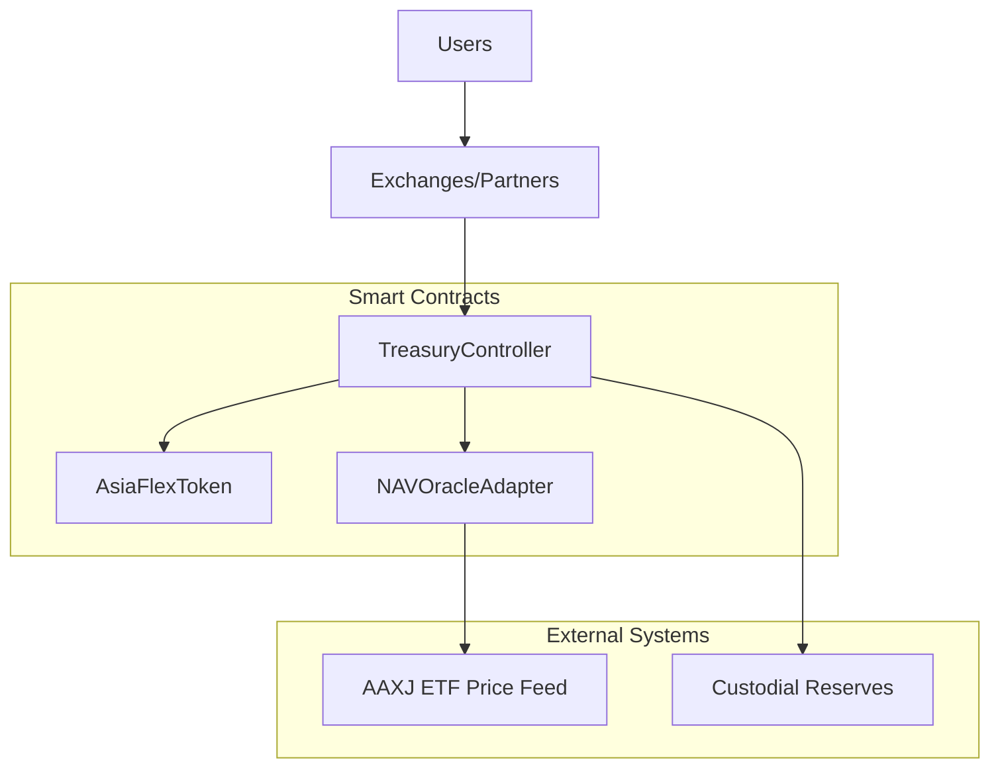

# AsiaFlex Token (AFX)

[](https://github.com/PolPol45/ASIAFLEX/actions)
[](https://codecov.io/gh/PolPol45/ASIAFLEX)
[](https://opensource.org/licenses/MIT)

Enterprise-grade ERC20 token with proof of reserves and treasury controls, backed by iShares MSCI All Country Asia ex Japan ETF (AAXJ).

## Overview

AsiaFlex is a stable digital token backed by the iShares MSCI All Country Asia ex Japan ETF (AAXJ), offering users in high-inflation, low-income regions:

- **Stable store of value** protected from local currency volatility
- **Indirect access** to growth potential of Asia's leading economies
- **Low-cost, cross-border digital liquidity** that is simple to use and widely accessible

### Recent Security Enhancements

This project has been significantly enhanced with enterprise-grade security features:

- ✅ **24-Hour Governance Timelock** - All critical parameter changes require 24h delay
- ✅ **Enhanced ProofOfReserve** - Deviation limits, attestation requirements, comprehensive logging
- ✅ **Oracle Resilience** - NAV caching, exponential backoff, force update with reason logging
- ✅ **Enhanced Role Management** - Role changes with reason tracking, detailed event logging
- ✅ **Comprehensive Documentation** - Governance framework, operational runbook, threat model
- ✅ **Fuzz Testing Infrastructure** - Property-based testing for critical invariants
- ✅ **Compliance Framework** - AML/KYC procedures, data protection, regulatory guidelines

See [CHANGELOG.md](./CHANGELOG.md) for complete details.

### Mission Statement

Our mission is to democratize access to an inflation-resistant, globally relevant financial asset—anchored in the strength, diversity, and dynamism of Asia's economies as represented by AAXJ—for underserved populations in emerging markets.

## Quick Demo

Get started with AsiaFlex Token in just a few commands:

```bash
# Install dependencies
npm ci

# Start local blockchain (in one terminal)
npm run dev:node

# Run complete demo scenario (in another terminal)
npm run dev:demo

# Optional: Monitor NAV price in real-time (in third terminal)
npm run dev:watch-price
```

The demo will:

- Deploy all contracts (AsiaFlexToken, NAVOracleAdapter, TreasuryController)
- Set up roles and initial NAV ($100.50)
- Mint 1,000 AFX to demo account
- Transfer 300 AFX between accounts
- Burn 100 AFX tokens
- Test pause/unpause and cap adjustments
- Generate detailed JSON report in `playground/out/`

For step-by-step instructions, see [playground/README_DEMO.md](playground/README_DEMO.md).

## Architecture



### Components

- **AsiaFlexToken**: ERC20 token with supply caps, circuit breakers, and role-based access
- **TreasuryController**: Controls mint/redeem flows with signed attestations
- **NAVOracleAdapter**: Oracle adapter for AAXJ NAV data with staleness protection
- **Proof of Reserve**: Regular attestations of backing reserves

## Contracts

### AsiaFlexToken

Enterprise-grade ERC20 with:

- **Supply Management**: Configurable supply caps and daily limits
- **Circuit Breakers**: Daily mint and net inflow limits
- **Access Control**: Role-based permissions (Treasury, Pauser, Caps Manager)
- **Security**: Pausable, ReentrancyGuard, optional blacklist functionality
- **Standards**: ERC20, ERC20Permit, EIP712 signatures

### TreasuryController

Centralized mint/redeem controller with:

- **Signed Attestations**: EIP712 signed requests for reserve validation
- **Time-bound Requests**: Configurable expiration for replay protection
- **Reserve Hash Validation**: Links operations to specific reserve states

### NAVOracleAdapter

Oracle for AAXJ price data with:

- **Staleness Protection**: Configurable age limits for price data
- **Deviation Limits**: Maximum allowed price movement between updates
- **Role-based Updates**: Controlled by Oracle Updater and Manager roles

## Roles & Permissions

| Role                     | Contract           | Permissions                         |
| ------------------------ | ------------------ | ----------------------------------- |
| `DEFAULT_ADMIN_ROLE`     | All                | Grant/revoke roles, admin functions |
| `TREASURY_ROLE`          | AsiaFlexToken      | Mint, burn, set reserves/price      |
| `PAUSER_ROLE`            | AsiaFlexToken      | Pause/unpause contract              |
| `CAPS_MANAGER_ROLE`      | AsiaFlexToken      | Modify supply caps and daily limits |
| `BLACKLIST_MANAGER_ROLE` | AsiaFlexToken      | Manage blacklist (if enabled)       |
| `ORACLE_UPDATER_ROLE`    | NAVOracleAdapter   | Update NAV price data               |
| `ORACLE_MANAGER_ROLE`    | NAVOracleAdapter   | Configure oracle parameters         |
| `TREASURY_MANAGER_ROLE`  | TreasuryController | Configure treasury parameters       |

## Security Model

### Circuit Breakers & Caps

- **Daily Mint Cap**: Maximum tokens that can be minted per day
- **Daily Net Inflow Cap**: Maximum net token inflow per day
- **Supply Cap**: Maximum total token supply
- **Circuit Breaker Pattern**: Automatic daily limit resets at 24-hour intervals

### Oracle Protection

- **Staleness Check**: Reject prices older than `maxAge` (default: 1 hour)
- **Deviation Limits**: Reject price changes exceeding `maxDeviation` (default: 1%)
- **Force Override**: Emergency oracle manager can bypass deviation checks

### CEI Pattern & Reentrancy Guards

- **Checks-Effects-Interactions**: All state changes before external calls
- **ReentrancyGuard**: Prevents reentrancy attacks on all critical functions
- **Fail-safe Design**: Contracts pause on unexpected conditions

### Access Controls & Roles

- **TREASURY_ROLE**: Controls mint/burn operations with attestations
- **PAUSER_ROLE**: Emergency pause capability
- **CAPS_MANAGER_ROLE**: Adjusts circuit breaker limits
- **BLACKLIST_MANAGER_ROLE**: Optional account blacklisting
- **ORACLE_UPDATER_ROLE**: Updates NAV pricing data

### Attestation Security

- **EIP712 Signatures**: Cryptographically signed mint/redeem requests
- **Replay Protection**: Time-bound requests with expiration
- **Reserve Hash Validation**: Links operations to specific reserve states
- **Treasury Signer**: Dedicated signer key for operation attestations

## Operations & Monitoring

### Operational Scripts

AsiaFlex includes comprehensive operational tooling for production management:

```bash
# Token Operations
npm run ops:mint        # Mint new tokens (supports dry-run)
npm run ops:burn        # Burn tokens (supports dry-run)
npm run ops:transfer    # Transfer tokens (supports dry-run)

# Contract Management
npm run ops:pause       # Pause/unpause contracts
npm run ops:setCaps     # Update supply caps and limits
npm run ops:status      # View system status

# Oracle Operations
npm run ops:nav         # Update NAV price from AAXJ

# Audit & History
npm run ops:history     # View operations audit trail
```

#### Example: Mint Operation

```bash
# Dry run first (recommended)
MINT_SIGNER=0xf39... \
MINT_TO=0x7099... \
MINT_AMOUNT=1000 \
MINT_DRY_RUN=true \
npm run ops:mint

# Execute if dry run looks good
MINT_DRY_RUN=false npm run ops:mint
```

See [docs/runbook.md](./docs/runbook.md) for complete operational procedures.

### Operations History

View complete audit trail of all operations:

```bash
# List recent operations
npx ts-node scripts/ops/history.ts list --limit=20

# Filter by network
npx ts-node scripts/ops/history.ts list --network=localhost

# View statistics
npx ts-node scripts/ops/history.ts stats

# Show detailed operation
npx ts-node scripts/ops/history.ts show 0
```

All operations are logged with:

- Transaction hashes and block numbers
- Timestamps and network
- Operation details (amounts, addresses)
- Results and any errors

### Governance & Timelock

Critical parameter changes require a 24-hour governance delay:

```solidity
// AsiaFlexTimelock provides 24h delay for:
- Supply cap changes
- Daily limit adjustments
- Oracle parameter updates
- Reserve deviation limits
- Critical role grants/revokes
```

See [docs/governance.md](./docs/governance.md) for governance procedures.

### Oracle Resilience

NAV oracle includes multiple resilience features:

- **Caching**: Automatic caching of NAV data for offline scenarios
- **Exponential Backoff**: Retry failed API calls with increasing delays
- **Rate Limit Handling**: Graceful degradation when API limits reached
- **Force Update**: Emergency manual override with reason logging

Example usage:

```typescript
import { NAVCacheManager, ExponentialBackoff } from "./utils/oracle/caching";

// Create cache manager
const cache = new NAVCacheManager({
  cacheDir: ".cache/nav",
  maxAge: 3600, // 1 hour
  enableFallback: true,
});

// Fetch with automatic caching and fallback
const { nav, fromCache } = await cache.getNAVWithFallback(async () => {
  return await fetchFromAlphaVantage();
});
```

See [docs/environment-variables.md](./docs/environment-variables.md) for configuration options.

## Branch Management & Cleanup

[/badge.svg>)](https://github.com/PolPol45/ASIAFLEX/actions/workflows/branch-audit.yml)

This repository includes automated branch audit and cleanup tools to maintain repository hygiene.

### Automated Workflows

- **📊 Branch Audit** - Weekly audit (Mondays 3 AM UTC) with GitHub Issues reporting
- **🗑️ Branch Cleanup** - Manual workflow for safe branch deletion (dry-run/delete modes)
- **🤖 Auto-delete Merged PR Heads** - Automatically removes merged PR branches

### Manual Tools

```bash
# Run branch audit
./scripts/audit-branches.sh

# Manual branch cleanup (interactive)
./scripts/delete-merged-branches.sh

# Custom exclusion pattern
./scripts/delete-merged-branches.sh "^(main|develop|release/|custom/)"
```

### Protected Branches

The following branches are **never** automatically deleted:

- `main`, `develop`, `dev`, `staging`, `production`, `gh-pages`
- `release/*`, `hotfix/*`

### Actions Available

- **Trigger Audit:** `Actions → Branch Audit → Run workflow`
- **Cleanup (Dry-run):** `Actions → Branch Cleanup → Run workflow → mode=dry-run`
- **Cleanup (Delete):** `Actions → Branch Cleanup → Run workflow → mode=delete`

### QA Diary

**Latest Audit Results:**

- **Audit Date:** 2025-09-11 12:28:21 UTC
- **Total Branches:** 17
- **Categories:**
  - 🤖 **Copilot branches:** 7 (potential cleanup candidates)
  - 🤖 **Dependabot branches:** 2 (automated dependency updates)
  - 🔄 **Development branches:** 4 (chore/, fix/ prefixes)
  - ❓ **Review needed:** 3 (revert-\* branches)
  - ✅ **Main branch:** 1 (protected)
- **Estimated Cleanup Time Saved:** ~30 minutes manual review → 2 minutes automated
- **Automation Benefits:** Consistent weekly audits, safe deletion workflows, PR integration

---

### Prerequisites

- Node.js 18+
- npm or yarn
- Git

### Setup

```bash
git clone https://github.com/PolPol45/ASIAFLEX.git
cd ASIAFLEX
npm install
cp .env.example .env
# Edit .env with your configuration
```

### Build

```bash
npm run build          # Compile contracts + TypeScript
npm run typecheck      # Type checking only
npm run clean          # Clean artifacts
```

### Testing

```bash
npm test               # Run all tests
npm run test:fork      # Run with mainnet fork
npm run coverage       # Generate coverage report
npm run gas-snapshot   # Gas usage analysis
```

### Linting

```bash
npm run lint           # Lint all files
npm run lint:sol       # Solidity only
npm run lint:ts        # TypeScript only
npm run lint:fix       # Auto-fix issues
```

### Fuzz Testing

Property-based testing for critical invariants:

```bash
# Run fuzz tests (slower, more comprehensive)
npm test -- test/fuzz/*.test.ts

# Key properties tested:
# - Total supply never exceeds supply cap
# - Burns never create tokens
# - Balance sum equals total supply
# - Transfers preserve value
# - Daily limits reset properly
# - Blacklist enforcement
# - Pause functionality
```

See [test/fuzz/AsiaFlexToken.fuzz.test.ts](./test/fuzz/AsiaFlexToken.fuzz.test.ts) for implementation details.

## Static Analysis

### Solhint

```bash
npm run lint:sol
```

Configured to check for:

- Visibility modifiers
- Event emissions
- Reentrancy patterns
- Naming conventions

### Slither

```bash
slither . --config-file slither.config.json
```

Static analysis for:

- Security vulnerabilities
- Code quality issues
- Gas optimization opportunities

## Deployment & Verification

### Environment Setup

Copy `.env.example` to `.env` and configure:

```bash
# Network RPCs
SEPOLIA_RPC_URL=https://sepolia.infura.io/v3/YOUR_KEY
MAINNET_RPC_URL=https://mainnet.infura.io/v3/YOUR_KEY

# Verification APIs
ETHERSCAN_API_KEY=your_etherscan_key
DEPLOYER_PK=your_private_key
```

### Deploy Contracts

```bash
npm run deploy:sepolia    # Deploy to Sepolia testnet
npm run deploy:mainnet    # Deploy to Ethereum mainnet
npm run deploy:polygon    # Deploy to Polygon
```

### Verify Contracts

```bash
npm run verify:sepolia    # Verify on Sepolia
npm run verify:mainnet    # Verify on Mainnet
npm run verify:polygon    # Verify on Polygon
```

Deployment artifacts are saved to `scripts/deployments/<network>.json`.

## Operations Runbook

Daily operations using built-in scripts:

### Mint Tokens

```bash
# Mint tokens for collateral backing
# example dry-run on localhost (requires localhost deployment file)
MINT_TO=0x70997970C51812dc3A010C7d01b50e0d17dc79C8 \
MINT_AMOUNT=1 \
MINT_DRY_RUN=true \
HARDHAT_NETWORK=localhost \
npx hardhat run scripts/ops/mint.ts

# Direct treasury mint with attestation
npx hardhat run scripts/ops/mint.ts --network <network>
```

### Burn/Redeem Tokens

```bash
# Burn tokens and reduce supply
npm run ops:burn
# Or: hardhat run scripts/ops/burn.ts --network localhost
```

### Update NAV Price

```bash
# Update oracle NAV with staleness/deviation checks
npm run ops:nav
# Or: hardhat run tasks/nav/update.ts --network localhost

# Example with specific NAV value
npx hardhat nav:update --nav 105.50 --network localhost
```

### Pause/Unpause Operations

```bash
# Emergency pause all operations
npm run ops:pause
# Or: hardhat run scripts/ops/pause.ts --network localhost
```

### Update Circuit Breaker Caps

```bash
# Update daily mint/burn caps
npm run ops:setCaps
# Or: hardhat run scripts/ops/setCaps.ts --network localhost
```

### System Status

```bash
# Check current token and oracle status
npm run ops:status
# Or: hardhat run scripts/ops/status.ts --network localhost
```

## Incident Response

### Security Incident

1. **Immediate**: Pause all contracts via `PAUSER_ROLE`
2. **Assess**: Determine scope and impact
3. **Coordinate**: Notify stakeholders and exchanges
4. **Remediate**: Deploy fixes or implement workarounds
5. **Resume**: Unpause after validation

### Oracle Malfunction

1. **Detect**: Monitor for stale/invalid price data
2. **Pause**: Stop oracle updates via `ORACLE_MANAGER_ROLE`
3. **Switch**: Activate backup oracle or manual updates
4. **Restore**: Resume automated updates after fix

## Versioning & Releases

This project uses [Semantic Versioning](https://semver.org/) and [Conventional Commits](https://www.conventionalcommits.org/).

### Release Process

Releases are automated via GitHub Actions:

1. Merge changes to `main` branch
2. Semantic Release generates version based on commit messages
3. CHANGELOG.md is updated automatically
4. GitHub Release created with artifacts

### Commit Message Format

```
type(scope): description

feat: add new feature
fix: bug fix
docs: documentation changes
style: formatting changes
refactor: code refactoring
test: test additions/updates
chore: build/dependency updates
```

## Contributing

1. Fork the repository
2. Create feature branch: `git checkout -b feature/amazing-feature`
3. Commit changes using conventional commits
4. Push branch: `git push origin feature/amazing-feature`
5. Open Pull Request

### Pre-commit Hooks

Husky enforces code quality:

- ESLint + Prettier for TypeScript
- Solhint for Solidity
- Commit message linting

## License

This project is licensed under the MIT License - see the [LICENSE](LICENSE) file for details.

---

## Additional Documentation

### Core Documentation

- [Architecture Details](./docs/architecture.md) - System architecture and component details
- [Contract APIs](./docs/contracts.md) - Complete contract interface documentation
- [Security Model](./docs/security.md) - Security features and threat mitigation
- [Testing Strategy](./docs/testing.md) - Comprehensive testing approach

### Operational Documentation

- [Operations Guide](./docs/operations.md) - Day-to-day operational procedures
- [Operational Runbook](./docs/runbook.md) - **NEW** Incident response, key rotation, emergency procedures
- [Operations History CLI](./scripts/ops/history.ts) - **NEW** Audit trail and operation tracking
- [Environment Variables](./docs/environment-variables.md) - **NEW** Complete env var documentation

### Governance & Security

- [Governance Framework](./docs/governance.md) - **NEW** Governance architecture, roles, and processes
- [Threat Model](./docs/threat-model.md) - **NEW** Comprehensive threat analysis and mitigations
- [Compliance Framework](./docs/compliance.md) - **NEW** AML/KYC procedures and regulatory guidelines
- [Oracle & Attestations](./docs/oracle-and-attestations.md) - Oracle operations and reserve attestations

### Development & Integration

- [CI/CD Pipeline](./docs/ci-cd.md) - Continuous integration and deployment
- [Project Brief](./docs/project-brief.md) - Project overview and roadmap

## Recent Enhancements

This project has undergone significant security and operational improvements:

### Smart Contract Enhancements

- ✅ **AsiaFlexTimelock**: 24-hour governance timelock for critical operations
- ✅ **Enhanced ProofOfReserve**: Deviation limits, attestation requirements, pausable
- ✅ **Force NAV Updates**: Reason logging for emergency oracle updates
- ✅ **Role Management**: Enhanced role grant/revoke with reason tracking

### Operational Tooling

- ✅ **Operations History CLI**: Complete audit trail of all operations
- ✅ **NAV Cache Manager**: Offline resilience with exponential backoff
- ✅ **Enhanced Scripts**: Dry-run support, better error handling, comprehensive logging

### Testing Infrastructure

- ✅ **Fuzz Testing**: Property-based tests for critical invariants
- ✅ **Enhanced Test Coverage**: ProofOfReserve, NAV force updates, comprehensive scenarios
- ✅ **Stress Tests**: High-frequency operation testing

### Documentation

- ✅ **Governance Framework**: Complete governance procedures and migration path
- ✅ **Operational Runbook**: Incident response, daily operations, emergency procedures
- ✅ **Threat Model**: 20+ identified threats with detailed mitigations
- ✅ **Compliance Framework**: AML/KYC procedures, regulatory requirements
- ✅ **Environment Variables**: Complete configuration documentation

See [CHANGELOG.md](./CHANGELOG.md) for complete release notes.
