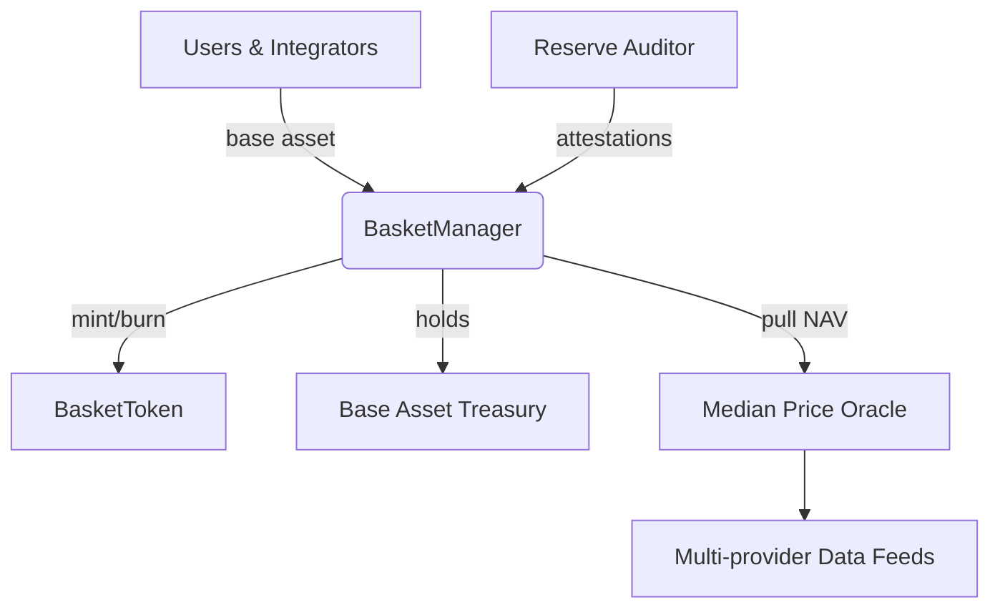

# AsiaFlex Multi-Basket Platform

[](https://github.com/PolPol45/ASIAFLEX/actions)
[](https://codecov.io/gh/PolPol45/ASIAFLEX)
[](https://opensource.org/licenses/MIT)

AsiaFlex now operates exclusively through a basket-based architecture. A single `BasketManager` coordinates five themed ERC20 baskets, each represented by a dedicated `BasketToken` and backed by attested reserves held in the designated base asset (USDC by default). NAV data is sourced from an off-chain median oracle and applied consistently across all baskets.

## Basket Catalog

| Token  | Region    | Strategy | Env Variable |
| ------ | --------- | -------- | ------------ |
| EUFX   | EU        | FX       | `TOK_EUFX`   |
| ASFX   | ASIA      | FX       | `TOK_ASFX`   |
| EUBOND | EU        | BOND     | `TOK_EUBOND` |
| ASBOND | ASIA      | BOND     | `TOK_ASBOND` |
| EUAS   | EURO_ASIA | MIX      | `TOK_EUAS`   |

Each token uses 18 decimals and is minted/burned exclusively via the `BasketManager` contract. Basket allocations can be reconfigured without redeploying tokens, and NAV updates apply atomically.

## Quickstart

```bash
npm ci

# Point to the deployed BasketManager instance
export BASKET_MANAGER=0x...

# Deploy all BasketToken contracts and capture their addresses
default
npm run deploy:sepolia           # prints TOK_* exports for convenience
export TOK_EUFX=0x...
export TOK_ASFX=0x...
export TOK_EUBOND=0x...
export TOK_ASBOND=0x...
export TOK_EUAS=0x...

# Register allocations and operational parameters
npm run ops:register:sepolia

# Seed NAV data for every basket
npm run ops:refresh:sepolia

# Example mint / redeem flows (requires USDC allowance)
HARDHAT_NETWORK=sepolia BASKET_KEY=EUFX BASE_AMOUNT=1000 BENEFICIARY=0xYourWallet \
  npm run ops:mint
HARDHAT_NETWORK=sepolia BASKET_KEY=EUFX TOKEN_AMOUNT=100 RECIPIENT=0xYourWallet \
  npm run ops:redeem
```

All scripts default to Hardhat's in-memory network. Append `--network <name>` to target a specific chain.

## Architecture



### Core Components

- **BasketManager** – Registers baskets, validates reserve proofs, orchestrates mint and redeem flows, and aggregates NAV across weighted asset exposures.
- **BasketToken** – Minimal ERC20 controlled by the manager. It exposes `mint` and `burn` only to holders of `MANAGER_ROLE` (i.e. the BasketManager).
- **Mock contracts** – Lightweight testing doubles (`MockERC20`, `MockMedianOracle`) provide deterministic fixtures for protocol unit tests.

## Roles & Permissions

| Role                   | Scope         | Purpose                                 |
| ---------------------- | ------------- | --------------------------------------- |
| `DEFAULT_ADMIN_ROLE`   | BasketManager | Configure allocations, configs, pause   |
| `TREASURY_ROLE`        | BasketManager | Reserved for future treasury flows      |
| `ORACLE_MANAGER_ROLE`  | BasketManager | Maintain oracle feeds and allocations   |
| `RESERVE_AUDITOR_ROLE` | BasketManager | Post reserve proofs & URIs              |
| `MANAGER_ROLE`         | BasketToken   | Assigned to BasketManager for mint/burn |

The legacy `AsiaFlexToken`, `TreasuryController`, and `NAVOracleAdapter` contracts have been removed. All operational tooling has been refactored to interact with the basket suite only.

## Operational Workflows

1. **Deploy tokens** – `scripts/deploy/deploy-basket-tokens.ts` mints five `BasketToken` contracts anchored to the live BasketManager.
2. **Register baskets** – `scripts/ops/register-baskets.ts` wires default allocations, staleness thresholds, and rebalance intervals. Customize the `ALLOCATIONS` map to adjust weights or introduce new symbols.
3. **Refresh NAV** – `scripts/ops/refresh-nav.ts` loops through every registered basket and refreshes NAV using the configured oracle.
4. **Mint / Redeem** – `scripts/ops/mint-basket.ts` and `scripts/ops/redeem-basket.ts` ingest environment variables and work for any basket. Per-basket wrappers (`mint-eufx.ts`, etc.) remain for backwards compatibility.
5. **Reserve attestations** – Use `BasketManager.registerProof` to post hash+URI pairs before minting against new proofs. Proof hashes are single-use to prevent replay.

See `README_OPERATIONS.md` for step-by-step console commands and env-driven mint/redeem examples.

## Development

```bash
# Compile contracts & regenerate typechain
npx hardhat compile

# Run unit tests
npm run test

# Run coverage (basket-focused suite)
npm run coverage
```

The TypeScript build artefacts in `dist/` mirror the on-chain helpers exposed under `scripts/ops`. Run `npm run build` to emit refreshed bundles after making script changes.

## Repository Structure

```
contracts/
  baskets/             # BasketManager + BasketToken contracts
  mocks/               # Testing doubles
scripts/
  deploy/              # BasketToken deployment helpers
  ops/                 # Operational scripts (register, mint, redeem, NAV)
test/
  unit/                # Hardhat test suite for basket contracts
```

## License

Distributed under the MIT License. See `LICENSE` for details.
