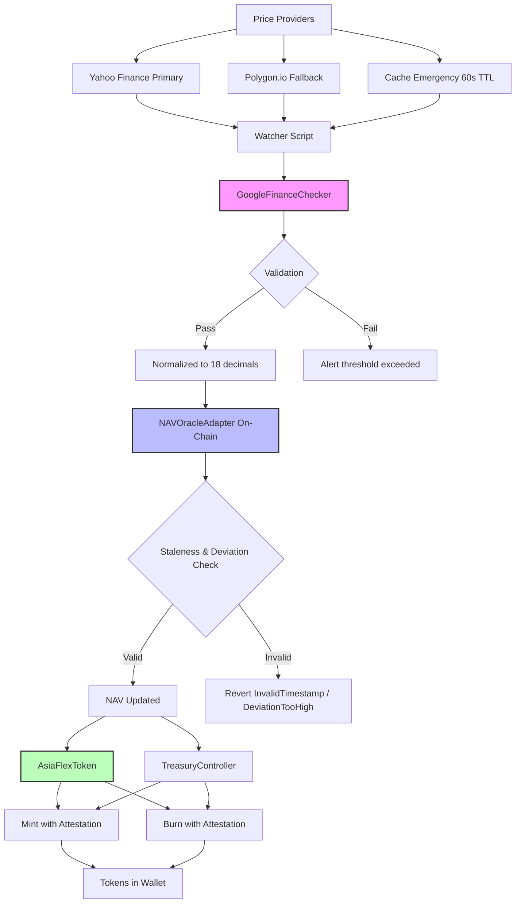

# ASIAFLEX — Basket-backed token & NAV oracle

A decentralized NAV (Net Asset Value) oracle system powering basket-backed ERC20 tokens with real-time multi-source price discovery, validation through cross-checks, and treasury-controlled minting/redemption flows.

**Branch State:** `docs/readme-full` | **Date:** 2025-10-21 | **Commit:** `84db315`

---

## How It Works (Overview for Non-Experts)

ASIAFLEX creates tokens whose value is backed by a basket of assets (e.g., Gold, BTC, ETH, Forex pairs). The system:

1. **Fetches prices** from multiple providers (Yahoo Finance, Polygon.io) with automatic fallback to cached values when primary sources fail
2. **Validates prices** against Google Finance to detect anomalies and alert on significant deviations
3. **Updates NAV on-chain** through a secure oracle with timestamp staleness protection and deviation thresholds
4. **Mints/Redeems tokens** via treasury-signed attestations that ensure proper reserve backing

The basket composition and NAV calculation determine token value. When NAV updates, token holders can mint new tokens (when providing reserves) or redeem tokens (when withdrawing reserves) through the TreasuryController.

### System Flow Diagram



### Basket Schema

A basket is defined by:

- **Asset Symbols**: e.g., `XAUUSD` (Gold), `BTCUSD` (Bitcoin), `EURUSD` (EUR/USD)
- **Weights**: Proportional allocation to each asset
- **NAV Calculation**: Weighted average of asset prices, normalized to USD

The NAV is recalculated when:

- Asset prices update (via watcher scripts)
- Basket composition changes (manual rebalancing)
- Staleness threshold is reached (forcing fresh data)

---

## Architecture & Technologies

### Core Modules

| Module               | Purpose                                                   | Key Files                    |
| -------------------- | --------------------------------------------------------- | ---------------------------- |
| **Smart Contracts**  | Token, Oracle, Treasury controller with role-based access | `contracts/*.sol`            |
| **Price Pipeline**   | Multi-provider fetching with fallback and validation      | `scripts/ops/providers/*.ts` |
| **Asset Mapping**    | Symbol → ticker resolution for price lookup               | `scripts/ops/assets.map.ts`  |
| **NAV Watcher**      | Automated price feed loop with on-chain commit            | `tasks/nav/update.ts`        |
| **Monitor & Status** | Health checks, alerting, reporting                        | `scripts/ops/status.ts`      |
| **E2E Operations**   | Full lifecycle: mint → transfer → redeem → burn           | `playground/demo-e2e.ts`     |

### Technologies

- **Blockchain**: Ethereum (Solidity 0.8.26), Sepolia testnet
- **Dev Framework**: Hardhat 3.x with TypeChain type generation
- **Runtime**: Node.js 20+, TypeScript 5.x
- **Web3 Library**: Ethers.js v6
- **CI/CD**: GitHub Actions (lint → build → test → coverage → Slither)
- **Price Sources**: Yahoo Finance API, Polygon.io API, Google Finance scraping
- **Standards**: ERC20, EIP-2612 (permit), EIP-712 (typed signatures), AccessControl

### Policy & Roles

| Role                     | Purpose                                  | Granted To                          |
| ------------------------ | ---------------------------------------- | ----------------------------------- |
| `DEFAULT_ADMIN_ROLE`     | Grant/revoke all roles                   | Deployer initially                  |
| `TREASURY_ROLE`          | Mint/burn tokens with attestations       | Treasury signer, TreasuryController |
| `PAUSER_ROLE`            | Pause/unpause token operations           | Treasury operations team            |
| `CAPS_MANAGER_ROLE`      | Adjust daily mint/inflow caps            | Risk management                     |
| `BLACKLIST_MANAGER_ROLE` | Add/remove addresses from blacklist      | Compliance                          |
| `ORACLE_UPDATER_ROLE`    | Submit new NAV values                    | Feeder wallet (automated)           |
| `ORACLE_MANAGER_ROLE`    | Configure staleness/deviation thresholds | Oracle governance                   |
| `TREASURY_MANAGER_ROLE`  | Update treasury signer                   | Treasury governance                 |

**Validation Policies:**

- **Timestamp Clamp**: NAV updates older than `stalenessThreshold` (default 24h) are rejected
- **Deviation Threshold**: NAV changes exceeding `deviationThreshold` (default 10%) are rejected unless forced
- **Prices Normalized**: All prices converted to 18 decimals for on-chain consistency
- **Degraded Mode**: If all providers fail, cached prices (max 60s old) are used with degraded flag

---

## Code Structure

### Directory Mapping

| Path                     | Responsibility                          | Entry Points                                                                                |
| ------------------------ | --------------------------------------- | ------------------------------------------------------------------------------------------- |
| `contracts/`             | Solidity smart contracts                | `AsiaFlexToken.sol`, `NAVOracleAdapter.sol`, `TreasuryController.sol`, `ProofOfReserve.sol` |
| `contracts/interfaces/`  | Contract interfaces                     | `IAsiaFlexToken.sol`, `INAVOracleAdapter.sol`, `ITreasuryController.sol`                    |
| `scripts/ops/`           | Operational scripts for token lifecycle | `mint.ts`, `burn.ts`, `pause.ts`, `setCaps.ts`, `status.ts`                                 |
| `scripts/ops/providers/` | Price provider implementations          | `Provider.ts`, `GoogleFinanceChecker.ts`                                                    |
| `scripts/deploy/`        | Deployment scripts                      | `00_deploy_asiaflex.ts`                                                                     |
| `tasks/`                 | Hardhat tasks for NAV and status        | `tasks/nav/update.ts`, `tasks/roles.ts`, `tasks/status.ts`                                  |
| `playground/`            | E2E demos and testing                   | `demo-e2e.ts`, `price-watcher.ts`                                                           |
| `test/`                  | Unit and integration tests              | `test/unit/*.test.ts`, `test/integration/*.test.ts`                                         |
| `deployments/`           | Network deployment configs              | `sepolia.example.json`                                                                      |
| `.github/workflows/`     | CI/CD pipelines                         | `ci.yml`, `slither.yml`, `codeql.yml`                                                       |

### Asset Map Configuration

**Location**: `scripts/ops/assets.map.ts`

Add new assets by editing:

```typescript
export const YAHOO_TICKERS: Record<string, string> = {
  XAUUSD: "GC=F", // Gold futures
  BTCUSD: "BTC-USD", // Bitcoin
  ETHUSD: "ETH-USD", // Ethereum
  EURUSD: "EURUSD=X", // EUR/USD forex
  USDJPY: "JPY=X", // USD/JPY forex
};

export const YAHOO_TICKER_ALIASES: Record<string, string> = {
  GOLD: "XAUUSD",
  BITCOIN: "BTCUSD",
  ETHER: "ETHUSD",
};
```

### Provider Fallback Order

**Priority**: `Yahoo → Polygon → Cache`

1. **Yahoo Finance** (primary): Fetches `regularMarketPrice` or latest `close` from chart data
2. **Polygon.io** (fallback): Uses for 6-char symbols (e.g., `EURUSD`) and `XAUUSD` when Yahoo fails
3. **Cache** (emergency): Returns last successful price if < 60s old and `useLastKnown` override is set

**Google Finance Checker**:

- Runs after each successful provider fetch
- Supports **dashed symbols** (e.g., `EUR-USD`), **inverse pairs** (e.g., `USDEUR` → `1/EURUSD`), and **overrides** for commodities like `XAUUSD` → `GCW00:COMEX`
- Alert thresholds: **1.0%** for FX pairs, **1.5%** for XAU (Gold)
- Logs: `[CHECKER:DASHED]`, `[CHECKER:INVERSE]`, `[CHECKER:OVERRIDE]`, `[CHECKER:ALERT]`

---

## Setup & Configuration

### Requirements

- **Node.js**: 20.x or later (LTS recommended)
- **Package Manager**: npm 10.x or pnpm
- **API Keys**:
  - Sepolia RPC URL (Infura, Alchemy, or public)
  - Polygon.io API key (optional, for fallback)
  - Etherscan API key (for contract verification)
- **Wallet**: Private key for feeder account with `ORACLE_UPDATER_ROLE`

### Environment Variables

Create `.env` files based on `.env.example`:

| Variable                | Purpose                                 | Example                                 |
| ----------------------- | --------------------------------------- | --------------------------------------- |
| `SEPOLIA_RPC_URL`       | Sepolia testnet RPC endpoint            | `https://sepolia.infura.io/v3/YOUR_KEY` |
| `MAINNET_RPC_URL`       | Mainnet RPC endpoint (for forking)      | `https://mainnet.infura.io/v3/YOUR_KEY` |
| `POLYGON_RPC_URL`       | Polygon network RPC endpoint            | `https://polygon-rpc.com`               |
| `PRIVATE_KEY`           | Deployer/feeder wallet private key      | `0x...`                                 |
| `FEEDER_PRIVATE_KEY`    | Dedicated feeder wallet for NAV updates | `0x...`                                 |
| `ETHERSCAN_API_KEY`     | Etherscan verification API key          | `YOUR_ETHERSCAN_KEY`                    |
| `POLYGONSCAN_API_KEY`   | Polygonscan verification API key        | `YOUR_POLYGONSCAN_KEY`                  |
| `POLYGON_API_KEY`       | Polygon.io price data API key           | `YOUR_POLYGON_KEY`                      |
| `OPS_ALERT_WEBHOOK`     | Webhook URL for operation alerts        | `https://hooks.slack.com/...`           |
| `REPORT_GAS`            | Enable gas reporting in tests           | `true` or `false`                       |
| `COINMARKETCAP_API_KEY` | CoinMarketCap API for gas price in USD  | `YOUR_CMC_KEY`                          |

**Creating `.env.nav-watch` for watcher scripts**:

```bash
# Copy example and fill in your values
cp scripts/ops/.env.nav-watch.example scripts/ops/.env.nav-watch

# Edit with your credentials (NEVER commit this file)
# Required: SEPOLIA_RPC_URL, FEEDER_PRIVATE_KEY
# Optional: POLYGON_API_KEY, OPS_ALERT_WEBHOOK
```

**⚠️ Security**: Never commit `.env*` files containing real secrets. Use placeholder values in examples.

---

## Quick Start (Local & Test)

### Install Dependencies

```bash
# Install all dependencies
npm ci --legacy-peer-deps

# Compile smart contracts
npx hardhat compile

# Build TypeScript
npm run build

# Run type checking
npm run typecheck

# Run linters
npm run lint
```

### Run Tests

```bash
# Run all tests
npm test

# Run tests with gas reporting
REPORT_GAS=true npm test

# Run coverage
npm run coverage
```

---

## Update Prices & NAV

### Single Run (Dry Run)

Test price fetching without committing to blockchain:

```bash
# Fetch prices for configured assets (dry run)
DOTENV_CONFIG_PATH=scripts/ops/.env.nav-watch \
  npm run ops:nav -- --once --network sepolia

# Note: Without --commit flag, this only fetches and validates prices
```

### Single Run with On-Chain Commit

Update NAV on Sepolia testnet:

```bash
# Update NAV on-chain (requires ORACLE_UPDATER_ROLE)
DOTENV_CONFIG_PATH=scripts/ops/.env.nav-watch OPS_NO_PROMPT=1 \
  npm run ops:nav:watch -- --once --network sepolia --commit
```

**Expected Output**:

```
[PROVIDER:YAHOO] XAUUSD = 2045.30
[CHECKER:OVERRIDE] XAUUSD = 2045.50
[PROVIDER:YAHOO] BTCUSD = 43250.75
[PROVIDER:YAHOO] EURUSD = 1.0892
🔮 Updating NAV to $XXX.XX...
✅ NAV updated successfully
Transaction Hash: 0x...
```

### Loop Mode (Continuous Watcher)

Run watcher in loop with configurable interval:

```bash
# Run watcher every 5 minutes
DOTENV_CONFIG_PATH=scripts/ops/.env.nav-watch OPS_NO_PROMPT=1 \
  npm run ops:nav:watch -- --loop --interval 300 --network sepolia --commit
```

**Logs**:

- `[PROVIDER:*]`: Price source used (Yahoo, Polygon, Cache)
- `[FALLBACK→*]`: Fallback triggered when primary fails
- `[CHECKER:*]`: Google Finance validation result
- `[DEGRADED]`: Using cached price due to provider failures
- Success/failure per asset with transaction hash or error

**Report Files**: JSON reports saved to `reports/` directory:

- `last_run.json`: Latest price fetch results
- `last_inverse.json`: Inverse pair resolutions
- Archive timestamped files for historical tracking

---

## Monitor & Alerting

### Run Monitor with Webhook Alerts

Monitor system health and send alerts on issues:

```bash
# Run monitor once with commit and webhook notification
DOTENV_CONFIG_PATH=scripts/ops/.env.nav-watch OPS_NO_PROMPT=1 \
  npm run nav:monitor -- --once --network sepolia --commit

# Webhook payload includes: NAV value, staleness status, provider success rates
```

### Validate Reports

Check integrity and consistency of saved reports:

```bash
# Validate all reports in reports/ directory
npm run validate:reports

# Expected output: ✅ All reports valid or ⚠️ warnings/errors
```

### Report Retention

**Saved Files**:

- `reports/last_run.json`: Most recent execution data
- `reports/last_inverse.json`: Inverse pair resolution cache
- `reports/archive/YYYY-MM-DD_HH-mm-ss.json`: Historical snapshots

**Alert Thresholds**:

- Google Finance diff > 1.0% (FX) or 1.5% (XAU): Warning logged and webhook sent
- Staleness > 24h: Critical alert
- All providers failed: Degraded mode alert

---

## Get Tokens in Your Wallet (E2E Operational Flow)

### Prerequisites

1. **Roles Configured**: Ensure your wallet has `TREASURY_ROLE` for mint/burn operations
2. **NAV Updated**: Recent NAV value on-chain (check with `npm run ops:status`)
3. **Network Setup**: Connected to Sepolia testnet with sufficient ETH for gas
4. **Deployment Config**: Valid deployment file at `deployments/sepolia.json`

### E2E Quick Flow (All Operations)

Run mint → transfer → redeem → burn in one script:

```bash
# Full lifecycle with small amounts (dry-run first)
npm run ops:e2e -- --network sepolia

# With commit to execute on-chain
npm run ops:e2e -- --commit --recipient 0xYourWalletAddress --network sepolia
```

### Individual Operations

#### Mint Tokens

```bash
# Mint 100 AFX tokens to recipient
# Requires: TREASURY_ROLE, daily caps available
npx hardhat run scripts/ops/mint.ts --network sepolia

# Via Hardhat task (with parameters)
npx hardhat mint --to 0xRecipientAddress --amount 100 --network sepolia
```

**Parameters**:

- `--to`: Recipient address
- `--amount`: Amount in AFX (e.g., `100` for 100 tokens)
- `--attestation-hash`: Optional reserve proof hash (defaults to zero hash)
- `--dry-run`: Simulate without committing

**Expected Output**:

```
🪙 Executing mint operation on sepolia
👤 Signer: 0x...
🎯 To: 0x...
💰 Amount: 100 AFX
🔍 Pre-flight checks:
   Treasury Role: ✅
   Contract Paused: ✅
   Remaining Daily Mint: 9900 AFX
✅ Mint successful
Transaction Hash: 0x...
```

#### Transfer Tokens

```bash
# Transfer 50 AFX from your wallet to another address
npx hardhat run scripts/transfer.js --network sepolia
```

**Manual Transfer** (via contract ABI):

```javascript
const token = await ethers.getContractAt("AsiaFlexToken", TOKEN_ADDRESS);
const tx = await token.transfer("0xRecipient", ethers.parseEther("50"));
await tx.wait();
```

#### Redeem Tokens

```bash
# Redeem 30 AFX (burns tokens, releases reserves)
# Requires: TREASURY_ROLE, signed attestation from treasury
npx hardhat run scripts/processRedeemChat.js --network sepolia
```

**Parameters**:

- `--from`: Token holder address
- `--amount`: Amount to redeem in AFX
- `--attestation-hash`: Required reserve withdrawal proof

#### Burn Tokens

```bash
# Burn 20 AFX tokens from holder
# Requires: TREASURY_ROLE
npx hardhat run scripts/ops/burn.ts --network sepolia
```

**Parameters**:

- `--from`: Address to burn from
- `--amount`: Amount in AFX to burn
- `--attestation-hash`: Optional attestation (defaults to zero hash)

### Verify in Wallet (Metamask)

1. **Add Sepolia Network**:
   - Network Name: Sepolia
   - RPC URL: Your `SEPOLIA_RPC_URL`
   - Chain ID: 11155111
   - Currency Symbol: ETH
   - Block Explorer: https://sepolia.etherscan.io

2. **Add AsiaFlex Token**:
   - Token Address: (from `deployments/sepolia.json` → `addresses.AsiaFlexToken`)
   - Token Symbol: AFX
   - Decimals: 18

3. **Check Balance**: Your AFX balance should appear after adding the token

### Minimal Test Sequence

```bash
# 1. Check current status
npm run ops:status -- --network sepolia

# 2. Mint small amount (1 AFX)
# Edit scripts/ops/mint.ts to set recipient and amount, then:
npx hardhat run scripts/ops/mint.ts --network sepolia

# 3. Verify balance on Sepolia Etherscan
# https://sepolia.etherscan.io/token/TOKEN_ADDRESS?a=YOUR_WALLET

# 4. Transfer to another address (0.5 AFX)
# Edit scripts/transfer.js with recipient and amount, then:
npx hardhat run scripts/transfer.js --network sepolia

# 5. Burn from holder (0.5 AFX)
# Edit scripts/ops/burn.ts with holder and amount, then:
npx hardhat run scripts/ops/burn.ts --network sepolia
```

**Expected Test Output**: Balance changes visible in Metamask and on Etherscan within 1-2 blocks.

---

## Troubleshooting

### Common Errors

#### `execution reverted: InvalidTimestamp`

**Cause**: NAV update timestamp is too old (exceeds `stalenessThreshold`)

**Fix**:

```bash
# Force fresh price fetch and update
DOTENV_CONFIG_PATH=scripts/ops/.env.nav-watch OPS_NO_PROMPT=1 \
  npm run ops:nav:watch -- --once --network sepolia --commit --force
```

#### `AccessControl: account 0x... is missing role`

**Cause**: Signer wallet doesn't have required role (e.g., `ORACLE_UPDATER_ROLE`, `TREASURY_ROLE`)

**Fix**:

```bash
# Check current roles
npm run ops:status -- --network sepolia

# Grant role (requires DEFAULT_ADMIN_ROLE)
npx hardhat grant-role --contract NAVOracleAdapter \
  --role ORACLE_UPDATER_ROLE --account 0xFeederAddress --network sepolia
```

#### `Provider rate limit exceeded`

**Cause**: Too many requests to Yahoo Finance or Polygon.io

**Fix**:

- Increase `--interval` in loop mode (e.g., `--interval 600` for 10 minutes)
- Implement exponential backoff (roadmap item)
- Use `--once` for manual updates

#### `Google Finance checker diff too high`

**Cause**: Price from provider differs >1% (FX) or >1.5% (XAU) from Google Finance

**Fix**:

- Check provider data source (might be stale or incorrect ticker)
- Verify Google Finance resolution path in logs (`[CHECKER:DASHED]`, `[CHECKER:INVERSE]`)
- If persistent, investigate market conditions or update thresholds

#### `DailyCapsExceeded`

**Cause**: Mint/burn amount exceeds configured daily caps

**Fix**:

```bash
# Check remaining capacity
npm run ops:status -- --network sepolia

# Increase caps (requires CAPS_MANAGER_ROLE)
npx hardhat run scripts/ops/setCaps.ts -- --network sepolia
# Edit setCaps.ts to set new maxDailyMint or maxDailyNetInflows
```

#### Contract is Paused

**Cause**: Token or oracle contract is in paused state

**Fix**:

```bash
# Unpause (requires PAUSER_ROLE or ORACLE_MANAGER_ROLE)
npx hardhat run scripts/ops/pause.ts -- --network sepolia --unpause
```

---

## Roadmap / What's Missing (Next Objectives)

### High Priority

- [ ] **Autosign Redeem (EIP-712)**
  - Variables: `TREASURY_SIGNER_KEY`, `EIP712_DOMAIN`, `PERMIT_JSON_PATH`
  - CLI flags: `--permit-json`, `--e2e-autosign`
  - Script: `scripts/ops/sign-permit.ts` for generating EIP-712 signatures
  - Retry logic for failed redemptions

- [ ] **Rate Limiting & Backoff**
  - Exponential backoff on provider failures
  - Request batching for multiple symbols
  - Circuit breaker after N consecutive failures

- [ ] **Test Coverage Improvements**
  - Monitor/checker unit tests (`scripts/ops/providers/GoogleFinanceChecker.test.ts`)
  - E2E integration tests (`test/integration/e2e-flow.test.ts`)
  - Fuzzing for NAV deviation edge cases

### Medium Priority

- [ ] **Report & Observability Hardening**
  - Structured logging with severity levels
  - Enhanced webhook payloads (include provider breakdown, gas usage)
  - Retention policy automation (purge old reports after 90 days)
  - Grafana/Prometheus metrics export

- [ ] **Multi-Network Support**
  - Mainnet deployment scripts with production config
  - Polygon PoS deployment
  - Cross-chain NAV synchronization (LayerZero or similar)

- [ ] **Governance Integration**
  - Timelock for critical parameter changes
  - Multisig for role grants
  - On-chain proposal system for basket rebalancing

### Low Priority / Nice-to-Have

- [ ] **Web UI Dashboard**
  - Real-time NAV display
  - Mint/redeem interface for users
  - Historical price charts

- [ ] **Advanced Oracle Features**
  - TWAP (Time-Weighted Average Price) calculation
  - Multiple oracle sources with median aggregation
  - Chainlink integration as fallback

### Known TODOs/FIXMEs in Code

_(None found in current codebase as of 2025-10-21)_

If additional TODOs emerge during development, they will be listed here with:

- **File**: `path/to/file.ts:line`
- **Issue**: Brief description
- **Priority**: High/Medium/Low

---

## CI/CD

### GitHub Actions Pipelines

All PRs and pushes to `main`/`develop` trigger automated checks:

| Job          | Purpose                                      | Status Badge                                                                                                                |
| ------------ | -------------------------------------------- | --------------------------------------------------------------------------------------------------------------------------- |
| **Lint**     | TypeScript & Solidity linting                | [](https://github.com/PolPol45/ASIAFLEX/actions)          |
| **Build**    | Compile contracts & TypeScript               | Same as above                                                                                                               |
| **Test**     | Run unit & integration tests                 | Same as above                                                                                                               |
| **Coverage** | Measure test coverage, upload to Codecov     | [](https://codecov.io/gh/PolPol45/ASIAFLEX) |
| **Slither**  | Static analysis for Solidity vulnerabilities | Runs on every PR, fails on high severity                                                                                    |

**Workflow Files**:

- `.github/workflows/ci.yml`: Main CI pipeline
- `.github/workflows/slither.yml`: Security static analysis
- `.github/workflows/codeql.yml`: CodeQL security scanning
- `.github/workflows/release.yml`: Semantic versioning and releases

**Quality Gates**:

- All linters must pass (0 warnings for TS, informational for Solidity)
- Test coverage must not decrease
- No high-severity Slither findings
- Successful build on Node.js 20

**Triggering Manually**:

```bash
# Re-run failed jobs in GitHub UI or via gh CLI
gh workflow run ci.yml --ref your-branch
```

---

## Contributing

1. Fork the repository
2. Create a feature branch (`git checkout -b feature/your-feature`)
3. Make minimal, focused changes
4. Run linters and tests (`npm run lint && npm test`)
5. Commit with conventional commits (e.g., `feat:`, `fix:`, `docs:`)
6. Push and open a PR against `main` branch

**PR Checklist**:

- [ ] Tests pass locally
- [ ] Code is linted and formatted
- [ ] Documentation updated (if applicable)
- [ ] No new high-severity security issues (run Slither locally)

---

## License

MIT License - see [LICENSE](./LICENSE) file for details.

---

## Contact & Support

- **Issues**: [GitHub Issues](https://github.com/PolPol45/ASIAFLEX/issues)
- **Discussions**: [GitHub Discussions](https://github.com/PolPol45/ASIAFLEX/discussions)
- **Security**: Report vulnerabilities privately via GitHub Security Advisories

---

**Last Updated**: 2025-10-21 | **Branch**: `docs/readme-full` | **Version**: 1.0.1
