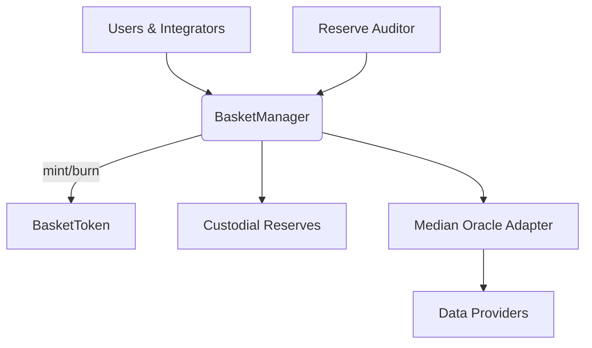
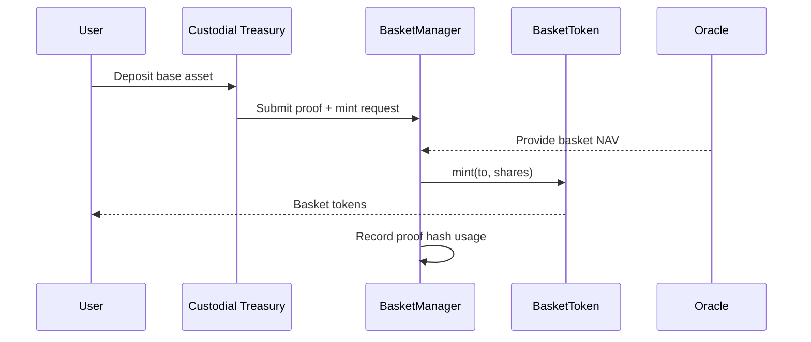
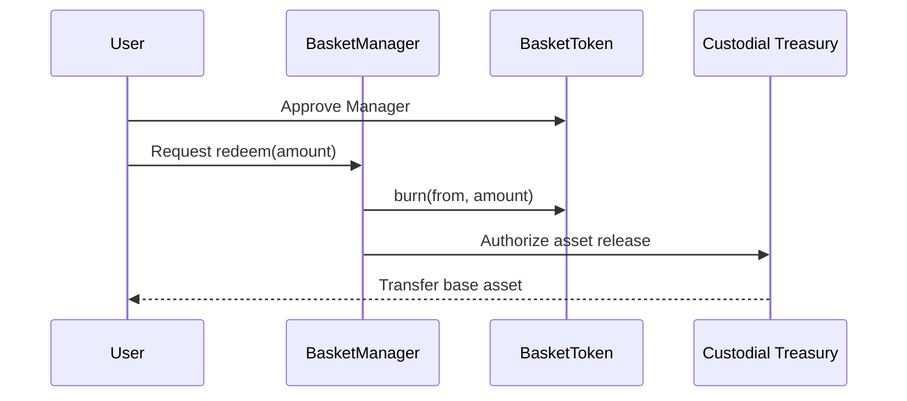

# Basket Architecture

## System Overview

AsiaFlex now operates as a basket-first platform. A single `BasketManager` contract coordinates themed ERC20 baskets (`BasketToken`s) that are fully collateralized with a base reserve asset. NAV updates come from a medianized oracle, while proof-of-reserve attestations ensure every basket remains backed one-to-one.

## Functional Domains

- **Basket Registration** – administrators register baskets by defining symbol, decimals, reserve asset, allocations, and operational limits.
- **NAV Lifecycle** – oracle managers push NAV data through the median oracle. NAV timestamps are enforced per-basket to prevent stale pricing.
- **Mint/Redeem Flow** – users transfer the reserve asset to the treasury, the `BasketManager` checks current NAV + proof, and mints/burns the corresponding `BasketToken`.
- **Proof Management** – reserve auditors publish signed proofs (`hash`, `uri`) that must be referenced for every mint cycle. Proof hashes cannot be reused.

## Sequence Diagrams

### Mint

### Redeem

## Contract Responsibilities

### BasketManager

- Registers baskets and persists configuration (allocations, oracle cadence, reserve asset).
- Validates reserve proofs before mint operations.
- Applies NAV updates across all baskets atomically.
- Maintains role-based access (`DEFAULT_ADMIN`, `TREASURY_ROLE`, `ORACLE_MANAGER_ROLE`, `RESERVE_AUDITOR_ROLE`).

### BasketToken

- Minimal ERC20 with `MANAGER_ROLE`-restricted mint/burn.
- Emits NAV and proof metadata via events to support analytics.

### Median Oracle (off-chain + adapter)

- Aggregates multiple price feeds.
- Enforces staleness and deviation thresholds before NAV propagation.

### Mock Contracts

- `MockERC20` and `MockMedianOracle` support deterministic unit tests and simulation environments.

## Security Layers

- **Role Separation** – independent roles for treasury, oracle management, and reserve attestations reduce blast radius.
- **Proof Replay Protection** – mint calls require a previously unused proof hash.
- **NAV Freshness** – per-basket `maxStaleness` thresholds guard against outdated prices.
- **Pause Hooks** – BasketManager can pause mint/redeem operations if reserve discrepancies are detected.

## Deployment Targets

- **Hardhat Network** – local development and test automation.
- **Sepolia** – integration testing and demo deployments.
- **Mainnet** – production counterpart once reserve infrastructure is live.

The legacy `AsiaFlexToken`, `TreasuryController`, and `NAVOracleAdapter` contracts have been removed from active architecture diagrams. BasketManager now encapsulates these responsibilities with clearer role isolation.
