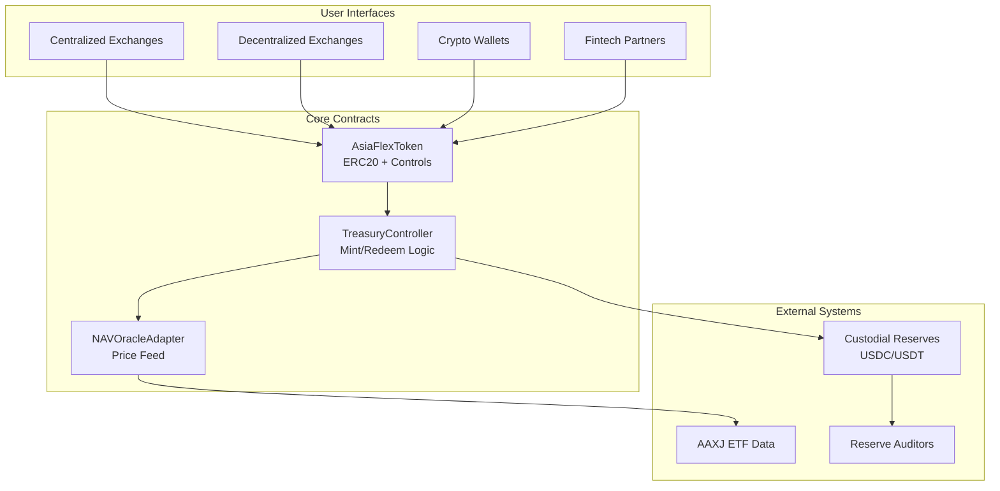
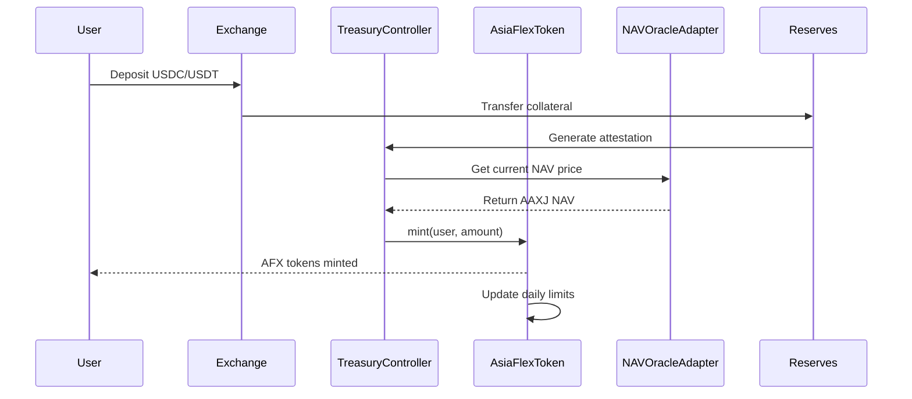
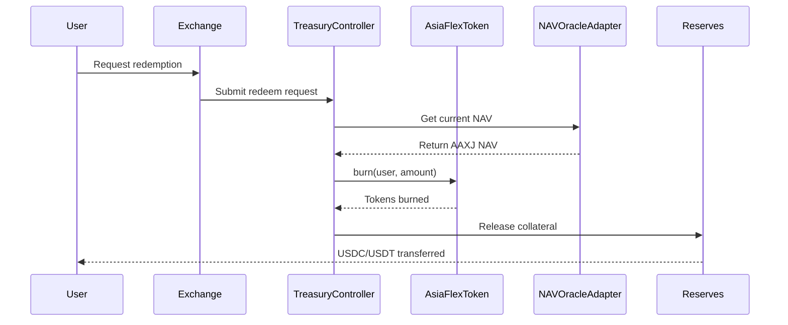

# Architecture Details

## System Overview

AsiaFlex is designed as a centralized, fully collateralized digital token with blockchain transparency. The architecture combines enterprise-grade smart contracts with off-chain reserve management.

## Contract Architecture

## Mint Flow

## Redeem Flow

## Component Details

### AsiaFlexToken

**Purpose**: Core ERC20 token with enterprise controls
**Key Features**:

- Supply caps and circuit breakers
- Role-based access control
- Pausable for emergencies
- Reentrancy protection
- EIP712 permit support

### TreasuryController

**Purpose**: Centralized mint/redeem operations with attestation validation
**Key Features**:

- EIP712 signed attestations
- Time-bound request validation
- Reserve hash verification
- Replay attack prevention

### NAVOracleAdapter

**Purpose**: Price feed management with protection mechanisms
**Key Features**:

- Staleness detection
- Deviation threshold enforcement
- Role-based price updates
- Historical price tracking

### Multi-Basket Extension

**Purpose**: Enable multi-asset, multi-region issuance with separate NAV tracks.
**Key Features**:

- `BasketManager` contract orchestrating six baseline products (EU/Asia/EuroAsia × FX/Bond).
- Dedicated `BasketToken` ERC20 per basket variant with manager-controlled mint/burn.
- NAV aggregation across FX, bond, and gold feeds with per-basket staleness thresholds.
- Proof-of-reserve anchoring and quarterly rebalance cadence support.

See [`multi-asset-architecture.md`](./multi-asset-architecture.md) for the full blueprint, weight tables, and operational workflow.

## Security Layers

### Access Control

- Multi-signature administrative wallets
- Role-based permissions (RBAC)
- Time-locked sensitive operations

### Circuit Breakers

- Daily mint limits
- Daily net inflow limits
- Total supply caps
- Emergency pause functionality

### Oracle Security

- Price staleness validation
- Deviation threshold checks
- Multiple data source validation
- Fallback price mechanisms

### Attestation Security

- EIP712 structured data signing
- Cryptographic proof of reserves
- Time-bound request validity
- Nonce-based replay protection

## Data Flow

### Price Updates

1. External systems monitor AAXJ NAV
2. Price changes validated against deviation limits
3. Oracle updater submits new price
4. Smart contract validates and stores price
5. Price available for mint/redeem operations

### Reserve Management

1. Collateral deposited to custodial accounts
2. Regular attestations generated by auditors
3. Reserve hashes included in mint/redeem attestations
4. On-chain validation of reserve commitments

## Deployment Architecture

### Production Environment

- **Mainnet**: Primary deployment for production use
- **Polygon**: Low-cost operations and broader accessibility
- **Layer 2s**: Future scalability as needed

### Testing Environment

- **Sepolia**: Primary testnet for integration testing
- **Hardhat**: Local development and unit testing
- **Fork Testing**: Mainnet state simulation

## Monitoring & Operations

### Key Metrics

- Total supply vs reserve ratios
- Daily mint/redeem volumes
- Oracle price deviation and staleness
- Circuit breaker trigger events

### Alerting

- Emergency pause events
- Circuit breaker activations
- Oracle staleness/deviation alerts
- Large mint/redeem operations

### Operational Procedures

- Daily reserve reconciliation
- Oracle price validation
- Circuit breaker monitoring
- Access control auditing
