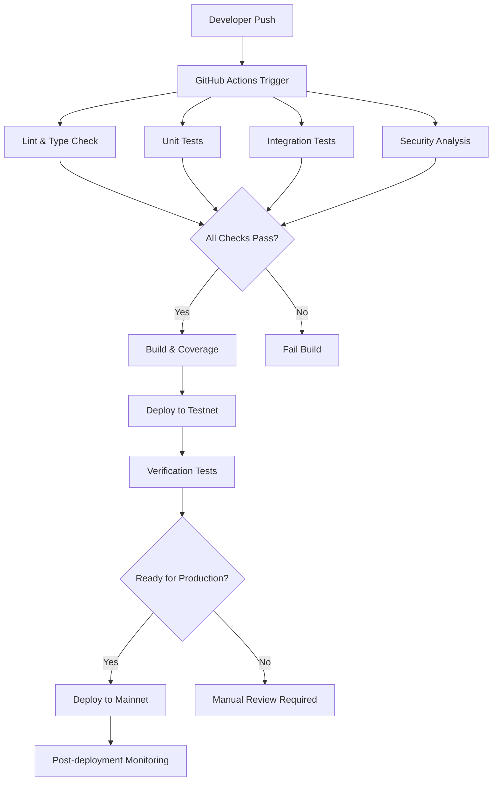

# CI/CD Pipeline

## Overview

The AsiaFlex CI/CD pipeline ensures code quality, security, and reliable deployments through automated testing, linting, security analysis, and deployment workflows.

## Pipeline Architecture



## Workflows

### Continuous Integration (.github/workflows/ci.yml)

```yaml
name: CI

on:
  push:
    branches: [ main, develop ]
  pull_request:
    branches: [ main, develop ]

env:
  FORCE_COLOR: 3

jobs:
  lint:
    name: Lint
    runs-on: ubuntu-latest
    steps:
      - uses: actions/checkout@v4
      - name: Setup Node.js
        uses: actions/setup-node@v4
        with:
          node-version: '20'
          cache: 'npm'
      
      - name: Install dependencies
        run: npm ci
      
      - name: Run TypeScript lint
        run: npm run lint:ts
      
      - name: Run Solidity lint
        run: npm run lint:sol

  build:
    name: Build
    runs-on: ubuntu-latest
    strategy:
      matrix:
        node-version: [18, 20]
    steps:
      - uses: actions/checkout@v4
      - name: Setup Node.js ${{ matrix.node-version }}
        uses: actions/setup-node@v4
        with:
          node-version: ${{ matrix.node-version }}
          cache: 'npm'
      
      - name: Install dependencies
        run: npm ci
      
      - name: Compile contracts
        run: npx hardhat compile
      
      - name: Build TypeScript
        run: npm run build
      
      - name: TypeScript type check
        run: npm run typecheck

  test:
    name: Test
    runs-on: ubuntu-latest
    needs: [build]
    steps:
      - uses: actions/checkout@v4
      - name: Setup Node.js
        uses: actions/setup-node@v4
        with:
          node-version: '20'
          cache: 'npm'
      
      - name: Install dependencies
        run: npm ci
      
      - name: Run tests
        run: npm test
        env:
          REPORT_GAS: true

  coverage:
    name: Coverage
    runs-on: ubuntu-latest
    needs: [build]
    steps:
      - uses: actions/checkout@v4
      - name: Setup Node.js
        uses: actions/setup-node@v4
        with:
          node-version: '20'
          cache: 'npm'
      
      - name: Install dependencies
        run: npm ci
      
      - name: Run coverage
        run: npm run coverage
      
      - name: Upload coverage reports
        uses: codecov/codecov-action@v4
        with:
          file: ./coverage/lcov.info
          fail_ci_if_error: true
          token: ${{ secrets.CODECOV_TOKEN }}

  security:
    name: Security Analysis
    runs-on: ubuntu-latest
    needs: [build]
    steps:
      - uses: actions/checkout@v4
      - name: Setup Node.js
        uses: actions/setup-node@v4
        with:
          node-version: '20'
          cache: 'npm'
      
      - name: Install dependencies
        run: npm ci
      
      - name: Setup Python for Slither
        uses: actions/setup-python@v4
        with:
          python-version: '3.x'
      
      - name: Install Slither
        run: pip install slither-analyzer
      
      - name: Run Slither
        run: slither . --config-file slither.config.json
        continue-on-error: true
      
      - name: Run additional security checks
        run: |
          echo "Running additional security analysis..."
          # Add custom security checks here
```

### Release Workflow (.github/workflows/release.yml)

```yaml
name: Release

on:
  push:
    branches:
      - main

env:
  FORCE_COLOR: 3

jobs:
  release:
    name: Release
    runs-on: ubuntu-latest
    if: "!contains(github.event.head_commit.message, 'skip ci')"
    
    steps:
      - name: Checkout
        uses: actions/checkout@v4
        with:
          fetch-depth: 0
          token: ${{ secrets.GITHUB_TOKEN }}
      
      - name: Setup Node.js
        uses: actions/setup-node@v4
        with:
          node-version: '20'
          cache: 'npm'
      
      - name: Install dependencies
        run: npm ci
      
      - name: Build project
        run: npm run build
      
      - name: Run tests
        run: npm test
      
      - name: Install semantic-release
        run: npm install -g semantic-release @semantic-release/changelog @semantic-release/git @semantic-release/github
      
      - name: Release
        env:
          GITHUB_TOKEN: ${{ secrets.GITHUB_TOKEN }}
        run: npx semantic-release
```

### Deployment Workflow (.github/workflows/deploy.yml)

```yaml
name: Deploy

on:
  workflow_dispatch:
    inputs:
      network:
        description: 'Network to deploy to'
        required: true
        default: 'sepolia'
        type: choice
        options:
        - sepolia
        - mainnet
        - polygon
      
      verify:
        description: 'Verify contracts after deployment'
        required: false
        default: true
        type: boolean

env:
  FORCE_COLOR: 3

jobs:
  deploy:
    name: Deploy to ${{ github.event.inputs.network }}
    runs-on: ubuntu-latest
    environment: ${{ github.event.inputs.network }}
    
    steps:
      - uses: actions/checkout@v4
      
      - name: Setup Node.js
        uses: actions/setup-node@v4
        with:
          node-version: '20'
          cache: 'npm'
      
      - name: Install dependencies
        run: npm ci
      
      - name: Compile contracts
        run: npx hardhat compile
      
      - name: Deploy contracts
        run: npm run deploy:${{ github.event.inputs.network }}
        env:
          DEPLOYER_PK: ${{ secrets.DEPLOYER_PK }}
          ETHERSCAN_API_KEY: ${{ secrets.ETHERSCAN_API_KEY }}
          POLYGONSCAN_API_KEY: ${{ secrets.POLYGONSCAN_API_KEY }}
      
      - name: Verify contracts
        if: ${{ github.event.inputs.verify == 'true' }}
        run: npm run verify:${{ github.event.inputs.network }}
        env:
          ETHERSCAN_API_KEY: ${{ secrets.ETHERSCAN_API_KEY }}
          POLYGONSCAN_API_KEY: ${{ secrets.POLYGONSCAN_API_KEY }}
      
      - name: Upload deployment artifacts
        uses: actions/upload-artifact@v3
        with:
          name: deployment-${{ github.event.inputs.network }}
          path: scripts/deployments/${{ github.event.inputs.network }}.json
```

## Quality Gates

### Pre-merge Checks
All pull requests must pass:
- ✅ Linting (ESLint + Solhint)
- ✅ Type checking (TypeScript)
- ✅ Unit tests (100% pass rate)
- ✅ Integration tests
- ✅ Security analysis (Slither)
- ✅ Coverage threshold (≥95%)

### Release Criteria
Main branch releases require:
- ✅ All CI checks passing
- ✅ Manual approval for production
- ✅ Security audit completion
- ✅ Documentation updates

### Deployment Gates
Production deployments require:
- ✅ Successful testnet deployment
- ✅ Contract verification
- ✅ Multi-signature approval
- ✅ Monitoring setup

## Security Scanning

### Slither Configuration (slither.config.json)
```json
{
  "filter_paths": [
    "node_modules",
    "test",
    "contracts/mocks"
  ],
  "detectors_to_exclude": [
    "timestamp",
    "low-level-calls",
    "naming-convention"
  ],
  "disable_informational": false,
  "disable_low": false,
  "disable_medium": false,
  "disable_high": false,
  "solc_args": "--optimize --optimize-runs 200"
}
```

### Security Analysis Steps
1. **Static Analysis**: Slither detects common vulnerabilities
2. **Dependency Scanning**: npm audit for known vulnerabilities
3. **License Scanning**: Ensure compatible licenses
4. **Secret Scanning**: Prevent credential leaks

### Security Reports
```typescript
// Security report generation
interface SecurityReport {
  timestamp: string;
  slitherResults: SlitherResult[];
  npmAuditResults: NpmAuditResult[];
  coverageReport: CoverageReport;
  gasAnalysis: GasAnalysis;
}

// Generate weekly security reports
async function generateSecurityReport(): Promise<SecurityReport> {
  return {
    timestamp: new Date().toISOString(),
    slitherResults: await runSlitherAnalysis(),
    npmAuditResults: await runNpmAudit(),
    coverageReport: await generateCoverageReport(),
    gasAnalysis: await analyzeGasUsage()
  };
}
```

## Monitoring & Alerts

### Build Status Monitoring
```yaml
# Status page configuration
status_checks:
  - name: "CI Pipeline"
    url: "https://github.com/PolPol45/ASIAFLEX/actions"
    expected_status: 200
    
  - name: "Test Coverage"
    url: "https://codecov.io/gh/PolPol45/ASIAFLEX"
    threshold: 95
    
  - name: "Security Scan"
    url: "https://github.com/PolPol45/ASIAFLEX/security"
    severity: "high"
```

### Slack Integration
```yaml
# Slack notification configuration
slack_notifications:
  channels:
    - name: "#dev-alerts"
      events: ["build_failure", "deployment_success"]
    - name: "#security-alerts"
      events: ["security_issue", "vulnerability_detected"]
    - name: "#releases"
      events: ["release_created", "deployment_complete"]
```

### GitHub Status Checks
```typescript
// Custom status checks
const statusChecks = [
  {
    name: "contracts/compile",
    description: "Smart contract compilation",
    required: true
  },
  {
    name: "tests/unit",
    description: "Unit test suite",
    required: true
  },
  {
    name: "tests/integration", 
    description: "Integration test suite",
    required: true
  },
  {
    name: "security/slither",
    description: "Static security analysis",
    required: true
  },
  {
    name: "coverage/threshold",
    description: "Code coverage ≥95%",
    required: true
  }
];
```

## Deployment Pipeline

### Environment Management
```typescript
// Environment configuration
interface Environment {
  name: string;
  network: string;
  rpcUrl: string;
  deployerKey: string;
  verificationApi: string;
  gasPrice: string;
  confirmations: number;
}

const environments: Record<string, Environment> = {
  development: {
    name: "development",
    network: "hardhat",
    rpcUrl: "http://localhost:8545",
    deployerKey: process.env.DEV_PRIVATE_KEY!,
    verificationApi: "",
    gasPrice: "auto",
    confirmations: 1
  },
  staging: {
    name: "staging", 
    network: "sepolia",
    rpcUrl: process.env.SEPOLIA_RPC_URL!,
    deployerKey: process.env.STAGING_PRIVATE_KEY!,
    verificationApi: process.env.ETHERSCAN_API_KEY!,
    gasPrice: "auto",
    confirmations: 2
  },
  production: {
    name: "production",
    network: "mainnet",
    rpcUrl: process.env.MAINNET_RPC_URL!,
    deployerKey: process.env.PROD_PRIVATE_KEY!,
    verificationApi: process.env.ETHERSCAN_API_KEY!,
    gasPrice: "auto",
    confirmations: 5
  }
};
```

### Deployment Strategy
1. **Development**: Automatic deployment on merge to develop
2. **Staging**: Manual deployment for testing
3. **Production**: Manual deployment with approvals

### Rollback Procedures
```typescript
// Rollback automation
interface RollbackPlan {
  contractAddress: string;
  previousVersion: string;
  rollbackSteps: string[];
  verificationSteps: string[];
}

async function executeRollback(plan: RollbackPlan) {
  console.log(`Starting rollback for ${plan.contractAddress}`);
  
  // 1. Pause current contracts
  await pauseContracts();
  
  // 2. Deploy previous version
  await deployPreviousVersion(plan.previousVersion);
  
  // 3. Verify rollback
  await verifyRollback(plan.verificationSteps);
  
  // 4. Resume operations
  await resumeContracts();
  
  console.log("Rollback completed successfully");
}
```

## Performance Monitoring

### Build Performance
```typescript
// Build time tracking
interface BuildMetrics {
  compilationTime: number;
  testExecutionTime: number;
  deploymentTime: number;
  totalPipelineTime: number;
}

// Performance thresholds
const PERFORMANCE_THRESHOLDS = {
  compilation: 120,      // 2 minutes
  tests: 300,           // 5 minutes  
  deployment: 600,      // 10 minutes
  totalPipeline: 900    // 15 minutes
};
```

### Resource Usage
```yaml
# Resource monitoring
resource_monitoring:
  cpu_threshold: 80%
  memory_threshold: 85%
  disk_threshold: 90%
  network_threshold: 100MB/s
```

## Badges & Status

### GitHub Badges
```markdown
[](https://github.com/PolPol45/ASIAFLEX/actions)
[](https://codecov.io/gh/PolPol45/ASIAFLEX)
[](https://sonarcloud.io/dashboard?id=PolPol45_ASIAFLEX)
[](https://opensource.org/licenses/MIT)
```

### Status Dashboard
```typescript
// Real-time status dashboard
interface SystemStatus {
  pipeline: 'passing' | 'failing' | 'unknown';
  coverage: number;
  security: 'secure' | 'vulnerable' | 'unknown';
  deployment: 'deployed' | 'deploying' | 'failed';
}

async function getSystemStatus(): Promise<SystemStatus> {
  return {
    pipeline: await getPipelineStatus(),
    coverage: await getCoveragePercentage(),
    security: await getSecurityStatus(),
    deployment: await getDeploymentStatus()
  };
}
```