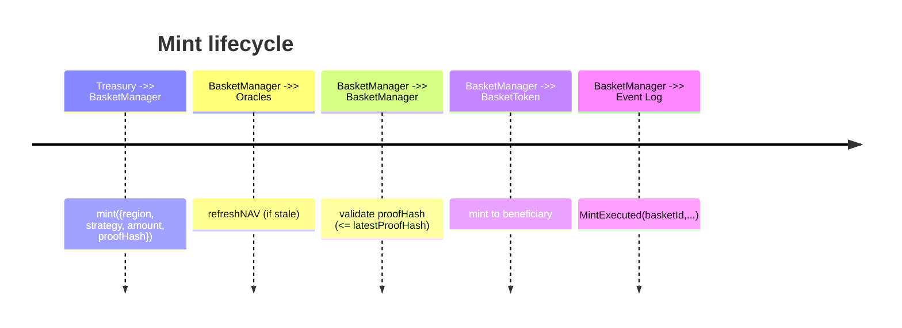

# Multi-Basket Architecture Upgrade

## Overview

The upgraded AsiaFlex platform expands beyond a single ETF-backed token to a family of geographically-scoped currency and bond baskets. Each product comes in two flavours (FX-backed and sovereign bond-backed) while sharing a consistent operational surface: a minter chooses the geographic basket (EU, Asia, EuroAsia) and the strategy (FX vs Bond). The smart-contract layer automatically routes mint, burn, NAV refresh, proof-of-reserve, and rebalance flows for the selected variant.

| Basket            | FX Composition                                                              | Bond Composition                                                  | Gold Allocation            |
| ----------------- | --------------------------------------------------------------------------- | ----------------------------------------------------------------- | -------------------------- |
| **EU-Unit**       | EUR 70%, GBP 15%, CHF 10%, SEK/NOK 5%                                       | Bund/BTP/UK Gilts/Swiss Govies/Scandi Govies mirroring FX weights | Shared 10% reserve overlay |
| **Asia-Unit**     | CNY 35%, JPY 20%, INR 15%, KRW 10%, SGD/HKD 10%, ASEAN 10%                  | CGB/JGB/G-Secs/KTB/SGS/ASEAN sovereigns matching weights          | Shared 10% reserve overlay |
| **EuroAsia-Unit** | EUR 30%, GBP 7%, CHF 3%, CNY 20%, JPY 15%, INR 7%, KRW 5%, SGD 3%, Gold 10% | EU + Asia sovereign ladder with aligned weights                   | 10%                        |

Each basket maintains its own NAV stream for FX and for Bond variants. NAVs are computed in USD with 18-decimal precision, combining Chainlink (or equivalent) price feeds, normalised weights, and a gold reference feed.

## Contract Components

### `BasketToken`

A minimal ERC20 whose mint/burn permissions are delegated to the basket manager. One token contract is instantiated per basket+strategy pair (six total in the core deployment), e.g.:

- `EUFXToken` – EU-Unit, FX basket
- `EUBondToken` – EU-Unit, Bond basket
- `AsiaFXToken`, `AsiaBondToken`
- `EuroAsiaFXToken`, `EuroAsiaBondToken`

### `BasketManager`

Central coordinator responsible for:

- Registering baskets with weights, NAV configuration, and rebalance cadence.
- Refreshing NAV measurements via aggregator oracles per asset component.
- Enforcing proof-of-reserve attestations, staleness thresholds, and mint/burn gating.
- Emitting rebalance, mint, redeem events consumed by operations desks or automated keeper bots.

Key storage layout:

- **Allocations**: `WeightedAsset[]` per basket, storing `assetId`, `AggregatorV3Interface feed`, `weightBps`.
- **Configs**: staleness threshold & rebalance interval per basket.
- **State**: last NAV (1e18), last NAV timestamp, last rebalance timestamp, latest proof hash/URI, BasketToken reference.
- **Proof tracking**: mapping of consumed proof hashes to avoid replay.

### Oracle Layer

All baskets now rely on the shared `MedianOracle` contract. Off-chain updaters push normalized USD prices (18 decimals) that the manager reads when computing NAV.

- **FX**: Pulled from the open `exchange-rate-api.com` feed (USD base) and inverted to express USD per unit of foreign currency.
- **Bond proxies**: Pulled from freely accessible ETF quotes on [stooq.com](https://stooq.com) (e.g. `BNDX.US`, `2822.HK`, `1476.JP`). These proxies track the regional sovereign debt ladders used in each basket.
- **Gold**: Pulled from the `XAUUSD` quote on Stooq, providing real-time bullion pricing.

The script `scripts/ops/update-median-oracle.ts` fetches all required market data, resolves USP/oz or USD-per-unit prices, and updates the on-chain oracle in a single transaction batch. Invoke it with:

```bash
npm run oracle:update -- --network localhost
```

The script reads `config/oracle-feeds.json`, which maps each basket asset to either FX pairs or Stooq symbols. Customize this file to swap data sources or adjust proxy tickers for production deployments.

Feeds are normalised to 18 decimals using `_fetchPrice`, aggregated by weight, and validated against per-basket staleness thresholds.

### Proof-of-Reserve + Audit Layer

`registerProof` allows a designated auditor to load the latest off-chain attestation hash and metadata URI. Treasury mints must reference the matching proof hash, ensuring issuance is backed by a fresh reserve report. Consumed proofs are tracked to prevent reuse.

Future integrations can plug an on-chain Merkle proof verifier (e.g., for custodial balances) using the stored proof hash as root identifier.

### Rebalancing

Each basket specifies a `rebalanceInterval` (e.g., 90 days). `triggerRebalance` enforces temporal cadence and emits an event consumed by off-chain execution (FX swaps, bond ladder adjustments). Allocation updates are governed by the Oracle Manager role and require new weights summing to 10,000 bps (100%).

## NAV Calculation

1. For each `WeightedAsset` in the basket allocation:
   - Pull `answer` and `updatedAt` from its price feed.
   - Scale the answer to 1e18 by inspecting `decimals()`.
   - Multiply by `weightBps` and sum across the basket.
2. Track the minimum `updatedAt` timestamp. If the maximum observed age exceeds the basket staleness threshold, revert.
3. Persist NAV and timestamp in basket state.
4. Expose NAV via `getNAV(basketId)`, with `refreshNAV` callable by keepers.

A sample NAV formula with gold overlay:

$$\text{NAV}_{FX, EU} = 0.70 P_{EURUSD} + 0.15 P_{GBPUSD} + 0.10 P_{CHFUSD} + 0.05 P_{SEKNOKUSD} + 0.10 P_{GOLDUSD}$$

Bond NAVs replace currency feeds with mark-to-market prices for sovereign debt notional (converted to USD via cross FX feeds when required by oracle adapters).

## Mint & Redeem Workflow



Redeem flow mirrors mint: user approves BasketToken transfer, `redeem` burns supply and emits `RedeemExecuted`, prompting off-chain payout of the basket assets pro-rata.

## Rebalancing Logic

- Keeper/treasury monitors calendar -> calls `triggerRebalance`.
- Event triggers off-chain hedging and bond roll actions; upon completion, Oracle Manager may call `updateAllocation` to adjust weightings (maintaining 10,000 bps total).
- NAV refreshes continue uninterrupted; new weights apply immediately for subsequent valuations.

## Extensibility

- **New Baskets**: call `registerBasket` with additional tokens and allocations.
- **Hybrid Strategies**: add new `Strategy` enum values and tokens; re-use existing manager pattern.
- **Oracle Upgrades**: `updateAllocation` supports feed replacements (e.g., migrating to custom risk-adjusted indices).
- **Automated Proof Pipeline**: integrate Chainlink CCIP or custom attestation contracts to automatically publish `proofHash` updates post audit.

## Integration Points

| Module             | Responsibility                                        | Notes                                               |
| ------------------ | ----------------------------------------------------- | --------------------------------------------------- |
| `BasketManager`    | Governance, NAV, mint/burn gating                     | Controlled via roles; supports timelock integration |
| `BasketToken`      | ERC20 per variant                                     | Optionally extend with Permit/AccessControl         |
| Oracle Keepers     | Periodic `refreshNAV` invocations                     | Hardhat task + keeper job sample provided below     |
| Operations Scripts | Mint/Burn/Status tasks extended with basket selection | CLI flag `--basket EU --strategy fx`                |
| Proof Publisher    | Off-chain audit pipeline                              | Writes proof hash & URI to manager                  |

## Sample Hardhat Task (NAV Refresh)

```typescript
await hre.ethers.getContractAt("BasketManager", manager).then(async (manager) => {
  const baskets = [0, 1, 2, 3, 4, 5];
  for (const id of baskets) {
    const tx = await manager.refreshNAV(id);
    await tx.wait();
  }
});
```

## Proof-of-Reserve Pipeline

1. Off-chain system aggregates custodial statements, generates Merkle root, uploads PDF to IPFS/S3.
2. Auditor wallet submits `registerProof(basketId, merkleRoot, uri)`.
3. Treasury mints reference `proofHash` to bind issuance to the attestation.
4. Optional: integrate on-chain verifier to accept Merkle proofs at redeem time.

## Deployment Blueprint

1. Deploy `BasketManager` with admin and timelock parameters.
2. Deploy six `BasketToken` contracts, set manager as admin and grant `MANAGER_ROLE`.
3. Register baskets with default weights:
   - `EU FX`: feeds for EURUSD, GBPUSD, CHFUSD, SEK/NOK (via synthetic or aggregated), GOLD.
   - `EU Bond`: Bund, BTP, Gilt, Swiss Govies, Nordic Govies, GOLD.
   - Repeat for Asia + EuroAsia.
4. Configure staleness thresholds (e.g., 1 hour for FX, 4 hours for bonds) and rebalance interval (90 days).
5. Load initial proof-of-reserve hash and publish to operations portal.
6. Update ops scripts to pass basket parameters during mint/burn.

## Security Considerations

- **Oracle Diversity**: mix of primary + backup feeds; enforce min answer > 0, latest round check, and staleness gating.
- **Proof Reuse**: consumed proof hashing prevents double counting; integrates with off-chain auditor signing.
- **Timelock**: `DEFAULT_ADMIN_ROLE` assigned to governance timelock; role assignments for treasury/oracle/auditor minted via scheduled proposals.
- **Circuit Breakers**: reuse AsiaFlexToken-style caps per basket (extend manager to track issuance vs limit).
- **Upgradability**: keep manager non-upgradable for clarity; adopt timelock + multisig for configuration changes.

## Next Steps

- Extend operations CLI (`scripts/ops/mint.ts`, `redeem.ts`) to accept `--basket EU --strategy bond` options, mapping to basket IDs.
- Wire NAV refresh + proof publication into CI (daily job) and Observability dashboards.
- Run simulation tests covering mint/redeem/rebalance flows using Hardhat/Foundry.
