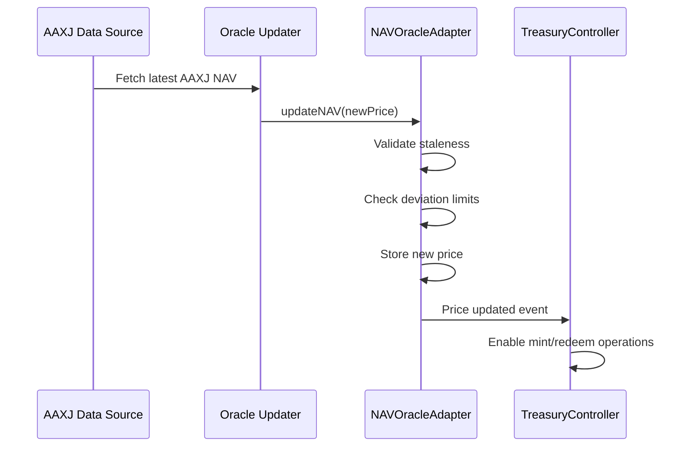

# Oracle & Attestations

## Oracle System Overview

The AsiaFlex oracle system provides reliable AAXJ ETF pricing data with built-in protection against manipulation and staleness. The system implements multiple validation layers to ensure price integrity.

## NAVOracleAdapter Architecture

### Core Components

```solidity
contract NAVOracleAdapter {
    // Price data storage
    uint256 private _currentNAV;
    uint256 private _lastUpdateTimestamp;
    
    // Protection parameters
    uint256 public stalenessThreshold;    // Maximum age in seconds
    uint256 public deviationThreshold;    // Maximum change in basis points
    
    // Access control
    bytes32 public constant ORACLE_UPDATER_ROLE = keccak256("ORACLE_UPDATER_ROLE");
    bytes32 public constant ORACLE_MANAGER_ROLE = keccak256("ORACLE_MANAGER_ROLE");
}
```

### Price Update Flow



## Staleness Protection

### Configuration Parameters
```typescript
const ORACLE_CONFIG = {
  STALENESS_THRESHOLD: 3600,      // 1 hour in seconds
  MAX_STALENESS_EMERGENCY: 14400, // 4 hours for emergency mode
  WEEKEND_EXTENSION: 172800       // 48 hours for market closures
};
```

### Staleness Validation
```solidity
function updateNAV(uint256 newNAV) external onlyRole(ORACLE_UPDATER_ROLE) {
    require(!paused(), "Oracle paused");
    
    // Check if current price is stale
    bool isCurrentStale = block.timestamp > _lastUpdateTimestamp + stalenessThreshold;
    
    if (!isCurrentStale) {
        // Normal update - check deviation
        _validateDeviation(_currentNAV, newNAV);
    }
    
    // Update price and timestamp
    uint256 previousNAV = _currentNAV;
    _currentNAV = newNAV;
    _lastUpdateTimestamp = block.timestamp;
    
    emit NAVUpdated(block.timestamp, previousNAV, newNAV);
}

function isStale() public view returns (bool) {
    return block.timestamp > _lastUpdateTimestamp + stalenessThreshold;
}
```

### Handling Market Closures
```typescript
// Weekend and holiday handling
class MarketHours {
  isMarketOpen(timestamp: number): boolean {
    const date = new Date(timestamp * 1000);
    const day = date.getDay();
    
    // AAXJ trades Monday-Friday
    if (day === 0 || day === 6) return false;
    
    // Check for holidays
    return !this.isHoliday(date);
  }
  
  getExtendedStalenessPeriod(timestamp: number): number {
    if (!this.isMarketOpen(timestamp)) {
      return ORACLE_CONFIG.WEEKEND_EXTENSION;
    }
    return ORACLE_CONFIG.STALENESS_THRESHOLD;
  }
}
```

## Deviation Protection

### Deviation Calculation
```solidity
function _validateDeviation(uint256 oldPrice, uint256 newPrice) internal view {
    if (oldPrice == 0) return; // First price update
    
    uint256 deviation;
    if (newPrice > oldPrice) {
        deviation = ((newPrice - oldPrice) * 10000) / oldPrice;
    } else {
        deviation = ((oldPrice - newPrice) * 10000) / oldPrice;
    }
    
    require(deviation <= deviationThreshold, "DeviationTooHigh");
}

function calculateDeviation(uint256 oldPrice, uint256 newPrice) 
    public 
    pure 
    returns (uint256) 
{
    if (oldPrice == 0) return 0;
    
    uint256 difference = oldPrice > newPrice ? 
        oldPrice - newPrice : 
        newPrice - oldPrice;
        
    return (difference * 10000) / oldPrice; // Return in basis points
}
```

### Dynamic Deviation Limits
```typescript
// Market volatility-based deviation adjustments
class DeviationManager {
  calculateDynamicThreshold(historicalVolatility: number): number {
    const baseThreshold = 100; // 1% in basis points
    const volatilityMultiplier = Math.min(historicalVolatility / 0.02, 3.0);
    
    return Math.floor(baseThreshold * volatilityMultiplier);
  }
  
  // Emergency deviation override for extreme market events
  async emergencyDeviationOverride(newPrice: number, justification: string) {
    // Requires multi-signature approval
    // Logs all overrides for audit
    await this.logDeviationOverride(newPrice, justification);
  }
}
```

## Attestation System

### EIP712 Structured Data

#### Domain Separator
```solidity
bytes32 private constant DOMAIN_SEPARATOR = keccak256(abi.encode(
    keccak256("EIP712Domain(string name,string version,uint256 chainId,address verifyingContract)"),
    keccak256(bytes("TreasuryController")),
    keccak256(bytes("1")),
    block.chainid,
    address(this)
));
```

#### Mint Request Structure
```solidity
struct MintRequest {
    address to;           // Recipient address
    uint256 amount;       // Amount to mint
    uint256 timestamp;    // Request timestamp
    bytes32 reserveHash;  // Hash of reserve proof
}

bytes32 private constant MINT_REQUEST_TYPEHASH = keccak256(
    "MintRequest(address to,uint256 amount,uint256 timestamp,bytes32 reserveHash)"
);
```

#### Redeem Request Structure
```solidity
struct RedeemRequest {
    address from;         // Token holder address
    uint256 amount;       // Amount to redeem
    uint256 timestamp;    // Request timestamp
    bytes32 reserveHash;  // Hash of reserve proof
}

bytes32 private constant REDEEM_REQUEST_TYPEHASH = keccak256(
    "RedeemRequest(address from,uint256 amount,uint256 timestamp,bytes32 reserveHash)"
);
```

### Attestation Generation

#### Off-chain Attestation Service
```typescript
class AttestationService {
  private treasuryPrivateKey: string;
  private domainSeparator: string;
  
  async generateMintAttestation(request: MintRequest): Promise<string> {
    // Validate request parameters
    await this.validateMintRequest(request);
    
    // Generate reserve hash
    const reserveHash = await this.calculateReserveHash();
    
    // Create EIP712 structured data
    const structHash = ethers.utils.keccak256(
      ethers.utils.defaultAbiCoder.encode(
        ["bytes32", "address", "uint256", "uint256", "bytes32"],
        [MINT_REQUEST_TYPEHASH, request.to, request.amount, request.timestamp, reserveHash]
      )
    );
    
    const digest = ethers.utils.keccak256(
      ethers.utils.concat([
        "0x1901",
        this.domainSeparator,
        structHash
      ])
    );
    
    // Sign the digest
    const signature = await this.signDigest(digest);
    
    return signature;
  }
  
  async calculateReserveHash(): Promise<string> {
    const reserves = await this.getCurrentReserves();
    return ethers.utils.keccak256(
      ethers.utils.defaultAbiCoder.encode(
        ["uint256", "uint256", "bytes32"],
        [reserves.totalAmount, reserves.timestamp, reserves.auditHash]
      )
    );
  }
}
```

### Signature Verification

#### On-chain Verification
```solidity
function verifyMintAttestation(
    address to,
    uint256 amount,
    uint256 timestamp,
    bytes32 reserveHash,
    bytes calldata signature
) public view returns (bool) {
    bytes32 structHash = keccak256(abi.encode(
        MINT_REQUEST_TYPEHASH,
        to,
        amount,
        timestamp,
        reserveHash
    ));
    
    bytes32 digest = _hashTypedDataV4(structHash);
    address recoveredSigner = ECDSA.recover(digest, signature);
    
    return recoveredSigner == treasurySigner;
}
```

#### Replay Protection
```solidity
mapping(bytes32 => bool) public usedRequests;

function _validateAndMarkRequest(
    bytes32 requestHash,
    uint256 timestamp
) internal {
    require(!usedRequests[requestHash], "Request already used");
    require(
        block.timestamp <= timestamp + requestExpiration,
        "Request expired"
    );
    
    usedRequests[requestHash] = true;
}
```

## Reserve Proof System

### Reserve Hash Calculation
```typescript
interface ReserveProof {
  totalUSDC: string;        // Total USDC reserves
  totalUSDT: string;        // Total USDT reserves
  totalOther: string;       // Other stablecoin reserves
  timestamp: number;        // Proof timestamp
  auditSignature: string;   // Auditor signature
  custodianAttestation: string; // Custodian attestation
}

function calculateReserveHash(proof: ReserveProof): string {
  return ethers.utils.keccak256(
    ethers.utils.defaultAbiCoder.encode(
      ["uint256", "uint256", "uint256", "uint256", "bytes32", "bytes32"],
      [
        proof.totalUSDC,
        proof.totalUSDT,
        proof.totalOther,
        proof.timestamp,
        ethers.utils.keccak256(proof.auditSignature),
        ethers.utils.keccak256(proof.custodianAttestation)
      ]
    )
  );
}
```

### Automated Reserve Verification
```typescript
class ReserveVerifier {
  async verifyReserves(): Promise<boolean> {
    // Fetch current reserves from custodian
    const custodianBalances = await this.fetchCustodianBalances();
    
    // Get current token supply
    const totalSupply = await this.getTokenSupply();
    
    // Calculate required reserves (at current NAV)
    const currentNAV = await this.getCurrentNAV();
    const requiredReserves = totalSupply * currentNAV / 1e18;
    
    // Verify adequate backing
    const totalReserves = custodianBalances.reduce((sum, balance) => sum + balance.amount, 0);
    
    return totalReserves >= requiredReserves;
  }
}
```

## Oracle Data Sources

### Primary Data Sources
1. **Bloomberg Terminal**: Real-time AAXJ pricing
2. **Refinitiv Eikon**: Alternative primary source
3. **Yahoo Finance API**: Backup source
4. **IEX Cloud**: Additional backup

### Data Source Integration
```typescript
class DataSourceManager {
  private sources: DataSource[] = [
    new BloombergSource(),
    new RefinitivSource(), 
    new YahooFinanceSource(),
    new IEXCloudSource()
  ];
  
  async fetchPrice(): Promise<number> {
    const prices: number[] = [];
    
    // Fetch from all available sources
    for (const source of this.sources) {
      try {
        const price = await source.getAAXJPrice();
        if (this.isValidPrice(price)) {
          prices.push(price);
        }
      } catch (error) {
        console.warn(`Failed to fetch from ${source.name}:`, error);
      }
    }
    
    // Require minimum 2 sources
    if (prices.length < 2) {
      throw new Error('Insufficient price sources available');
    }
    
    // Use median price to avoid outliers
    return this.calculateMedian(prices);
  }
}
```

### Failover Mechanisms
```typescript
class OracleFailover {
  async handleSourceFailure(failedSource: string) {
    // Log failure
    await this.logSourceFailure(failedSource);
    
    // Switch to backup sources
    await this.activateBackupSources();
    
    // Alert operations team
    await this.sendFailureAlert(failedSource);
    
    // Attempt automatic recovery
    setTimeout(() => this.attemptSourceRecovery(failedSource), 300000); // 5 minutes
  }
}
```

## Monitoring & Alerts

### Oracle Health Monitoring
```typescript
interface OracleMetrics {
  lastUpdateTime: number;
  priceDeviation: number;
  updateFrequency: number;
  sourceAvailability: Record<string, boolean>;
  failureCount: number;
}

class OracleMonitor {
  async checkHealth(): Promise<OracleMetrics> {
    return {
      lastUpdateTime: await this.getLastUpdateTime(),
      priceDeviation: await this.calculateCurrentDeviation(),
      updateFrequency: await this.getUpdateFrequency(),
      sourceAvailability: await this.checkSourceAvailability(),
      failureCount: await this.getFailureCount()
    };
  }
}
```

### Alert Configuration
```yaml
oracle_monitoring:
  staleness_alert:
    threshold: 3600  # 1 hour
    severity: HIGH
    
  deviation_alert:
    threshold: 100   # 1% in basis points
    severity: MEDIUM
    
  source_failure:
    threshold: 2     # Multiple source failures
    severity: HIGH
    
  update_frequency:
    min_updates_per_hour: 1
    severity: MEDIUM
```